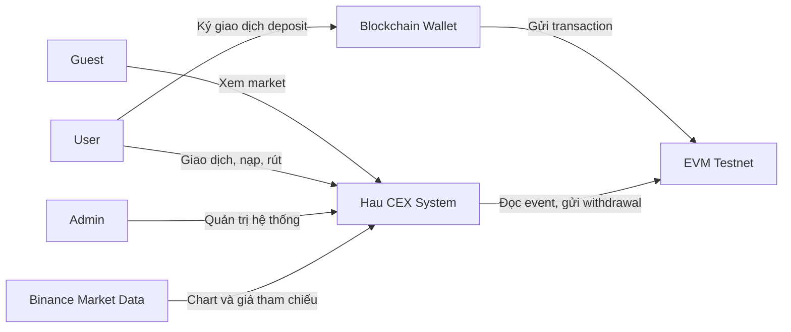
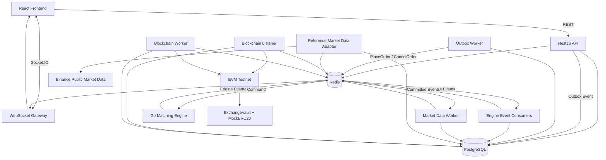
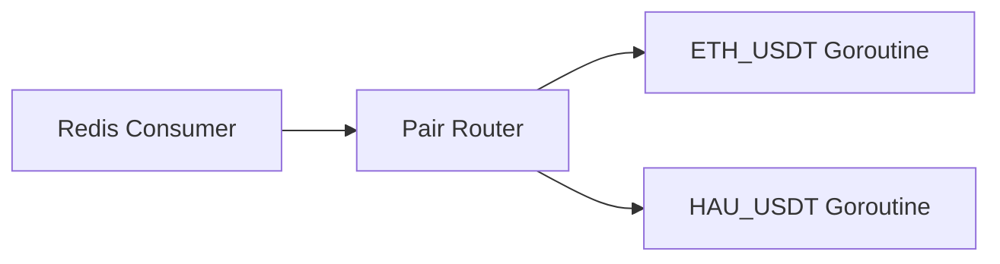
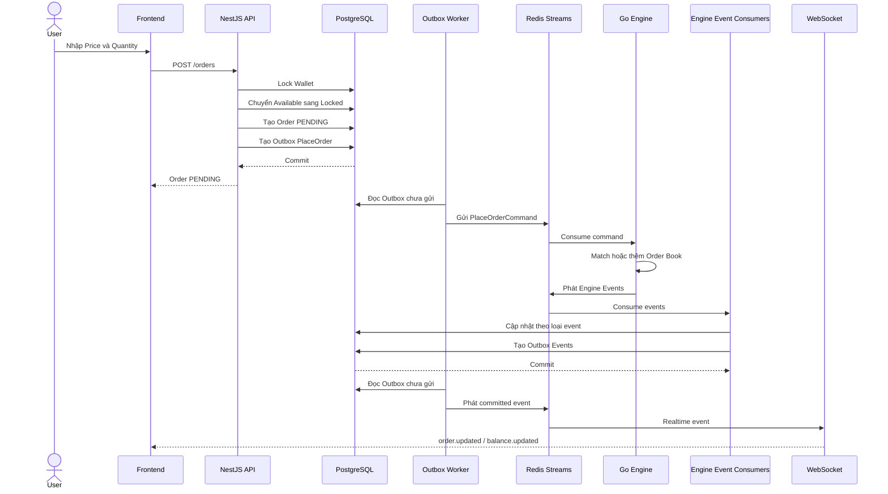
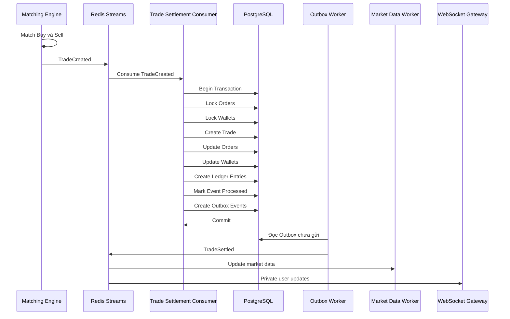
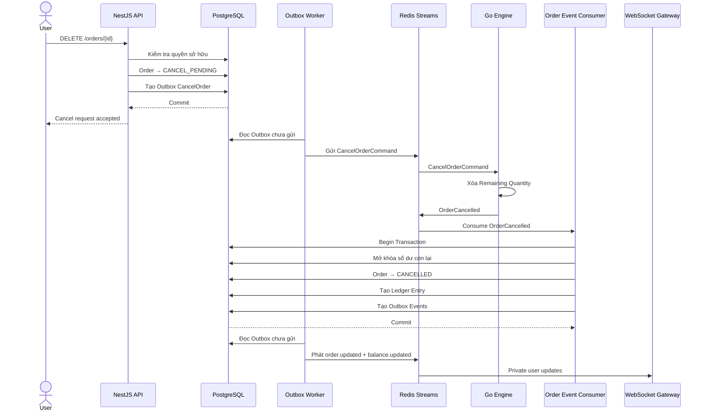
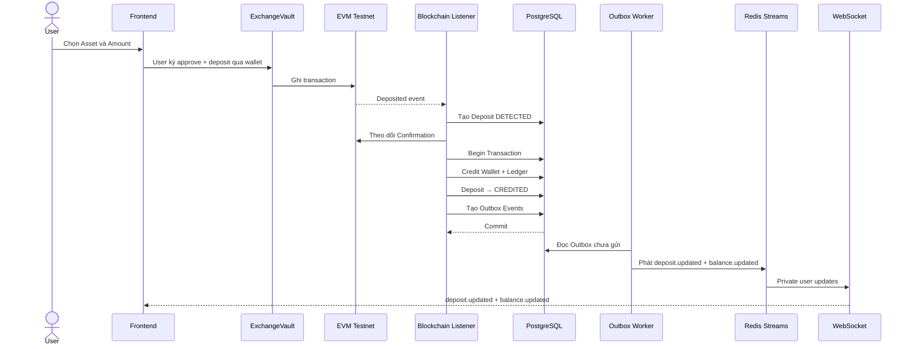
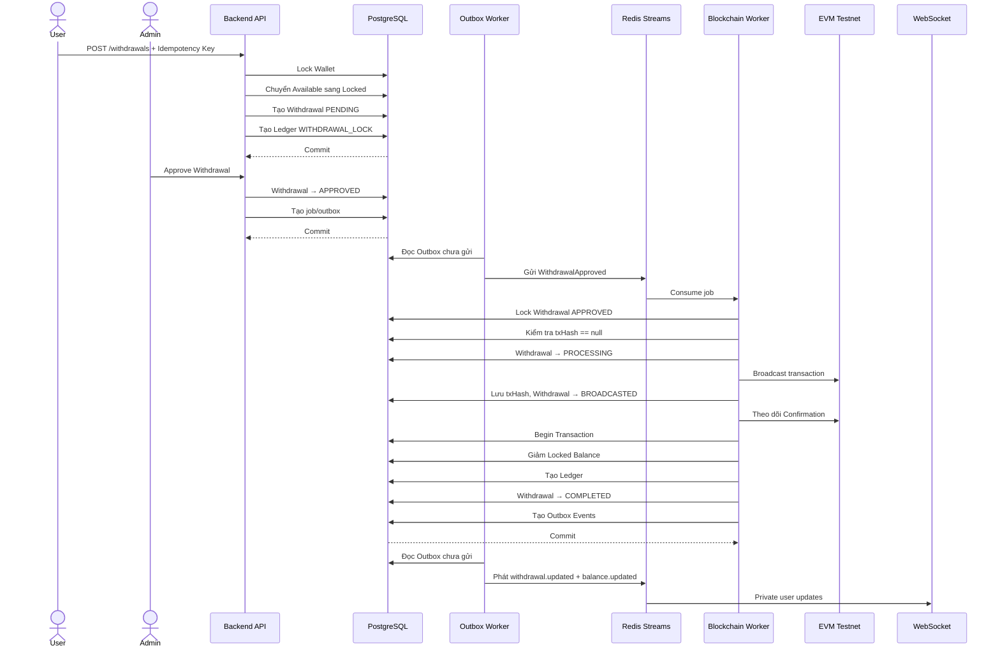
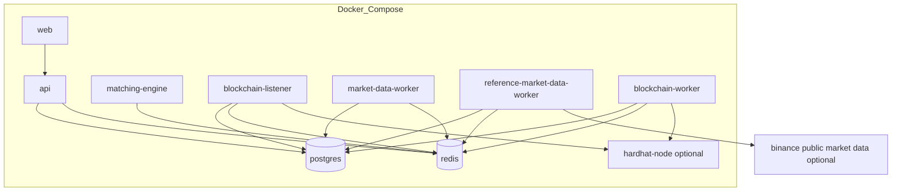

# Hau CEX — System Architecture

## 1. Mục đích

Tài liệu này mô tả kiến trúc tổng thể của hệ thống Hau CEX, bao gồm:

- Các thành phần chính của hệ thống.
- Trách nhiệm của từng service.
- Cách các thành phần giao tiếp với nhau.
- Nguồn dữ liệu chính của từng loại dữ liệu.
- Các luồng nghiệp vụ quan trọng.
- Cơ chế bảo đảm tính nhất quán, idempotency và khả năng phục hồi.
- Phương án triển khai trong môi trường local và production demo.

---

## 2. Phạm vi kiến trúc

Hau CEX là hệ thống mô phỏng sàn giao dịch tài sản số tập trung, hỗ trợ:

- Spot Trading.
- Limit Buy và Limit Sell.
- Matching Engine viết bằng Go.
- Wallet nội bộ và Ledger.
- Realtime Order Book, Recent Trades đã settlement và Balance.
- Biểu đồ tham chiếu mặc định từ Binance để học/demo frontend và biểu đồ nội bộ tùy chọn từ Hau CEX.
- Deposit và Withdrawal token ERC-20 trên EVM testnet.
- Quản trị User, Asset, Trading Pair và Withdrawal.

Hệ thống chỉ phục vụ mục đích học tập và demo, không xử lý tài sản có giá trị thật.

---

## 3. Phong cách kiến trúc

Hệ thống sử dụng mô hình:

```text
Modular Monolith
+ Independent Workers
+ Event-Driven Communication
```

Trong đó:

- Backend API được xây dựng dưới dạng modular monolith bằng NestJS.
- Matching Engine là một service độc lập viết bằng Go.
- Blockchain Listener, Blockchain Worker, Market Data Worker và Reference Market Data Adapter chạy dưới dạng process độc lập.
- PostgreSQL là nguồn dữ liệu bền vững chính.
- Redis được sử dụng cho cache, message stream và background job.
- Frontend giao tiếp với Backend bằng REST API và WebSocket.

### 3.1. Lý do lựa chọn

Mô hình này được chọn vì:

1. Dễ phát triển hơn kiến trúc microservice đầy đủ.
2. Vẫn thể hiện được ranh giới giữa các domain quan trọng.
3. Matching Engine có thể phát triển và tối ưu độc lập bằng Go.
4. Có thể áp dụng message broker, retry, idempotency và outbox pattern.
5. Phù hợp với phạm vi một dự án cá nhân hoặc nhóm nhỏ.
6. Có khả năng tách thêm service khi hệ thống phát triển.

---

## 4. Công nghệ chính

| Thành phần            | Công nghệ                  |
| --------------------- | -------------------------- |
| Frontend              | React, TypeScript, Vite    |
| Backend API           | NestJS, TypeScript         |
| Matching Engine       | Go                         |
| Database              | PostgreSQL                 |
| ORM                   | Prisma                     |
| Cache và Messaging    | Redis                      |
| Message Stream        | Redis Streams              |
| Background Job        | BullMQ                     |
| Realtime              | Socket.IO                  |
| Reference Market Data | Binance public market data |
| Smart Contract        | Solidity, OpenZeppelin     |
| Contract Development  | Hardhat                    |
| Blockchain Client     | viem                       |
| Local Infrastructure  | Docker Compose             |
| CI/CD                 | GitHub Actions             |

---

## 5. Sơ đồ ngữ cảnh hệ thống



---

## 6. Sơ đồ container



---

## 7. Các thành phần chính

### 7.1. React Frontend

#### Trách nhiệm

- Hiển thị giao diện người dùng.
- Gọi REST API.
- Kết nối WebSocket.
- Hiển thị Market, Order Book và Recent Trades của Hau CEX.
- Hiển thị chart với hai nguồn `BINANCE` và `HAU`.
- Mặc định hiển thị `BINANCE` như Binance Reference.
- Hiển thị rõ nhãn nguồn chart, ví dụ `BTC/USDT · Binance Reference` hoặc `BTC/USDT · Hau CEX Market`.
- Cho phép User đặt và hủy Order.
- Cho phép User nạp và rút Asset.
- Cung cấp trang quản trị cho Admin.

#### Không chịu trách nhiệm

- Kiểm tra số dư cuối cùng.
- Tính toán settlement.
- Xác định thứ tự matching.
- Lưu dữ liệu tài chính.
- Quyết định trạng thái nghiệp vụ.

Frontend chỉ thực hiện validation phục vụ trải nghiệm. Backend phải validate lại toàn bộ dữ liệu.

---

### 7.2. NestJS Backend API

Backend API là modular monolith, chịu trách nhiệm xử lý phần lớn nghiệp vụ ngoài Matching Engine.

#### Các module chính

```text
auth
users
assets
trading-pairs
wallets
ledger
orders
trades
deposits
withdrawals
market-data
reference-market-data
websocket
admin
audit
outbox
common
```

#### Trách nhiệm

- Authentication và authorization.
- Quản lý User và Admin.
- Quản lý Asset và Trading Pair.
- Validate Order.
- Kiểm tra và khóa số dư.
- Tạo Order trong PostgreSQL.
- Tạo Outbox Event.
- Settlement Trade.
- Quản lý Wallet và Ledger.
- Xử lý Deposit và Withdrawal.
- Cung cấp REST API.
- Phát private WebSocket event sau khi transaction commit.

#### Không chịu trách nhiệm

- Tự thực hiện matching.
- Duy trì in-memory Order Book.
- Tự xác định Best Bid và Best Ask trong luồng matching.

---

### 7.3. Go Matching Engine

Matching Engine là service độc lập viết bằng Go.

#### Trách nhiệm

- Nhận `PlaceOrderCommand`.
- Nhận `CancelOrderCommand`.
- Quản lý Order Book trong memory.
- Áp dụng Price-Time Priority.
- Thực hiện partial fill và full fill.
- Tạo `TradeCreatedEvent`.
- Phát trạng thái Order.
- Phát dữ liệu thay đổi Order Book.
- Tạo snapshot.
- Khôi phục Order Book sau khi restart.

#### Không chịu trách nhiệm

- Xác thực User.
- Kiểm tra số dư.
- Ghi Wallet.
- Ghi Ledger.
- Xử lý blockchain.
- Tính quyền truy cập.

#### Mô hình concurrency

Mỗi Trading Pair được xử lý tuần tự bởi một Pair Engine:

```text
ETH_USDT → Goroutine riêng
HAU_USDT → Goroutine riêng
```

Các command của cùng Trading Pair đi qua cùng một channel.



Mục tiêu:

- Giữ đúng thứ tự lệnh.
- Tránh nhiều goroutine cùng sửa một Order Book.
- Giảm nhu cầu sử dụng mutex.
- Dễ kiểm thử và phục hồi.

---

### 7.4. Engine Event Consumers

Engine Event Consumers thuộc phía Backend và xử lý các event từ Matching Engine.

Trong MVP, các consumer này có thể chạy trong cùng một process, nhưng trách nhiệm logic phải tách rõ.

#### Trách nhiệm

- Order Event Consumer xử lý `OrderAccepted`, `OrderRejected`, `OrderOpened` và `OrderCancelled`.
- Trade Settlement Consumer xử lý `TradeCreated`.
- Các trạng thái fill như `PARTIALLY_FILLED` và `FILLED` trong PostgreSQL được cập nhật bởi Trade Settlement Consumer khi settlement `TradeCreated`.
- Nếu Matching Engine phát event runtime như `OrderPartiallyFilled` hoặc `OrderFilled`, hệ thống chỉ dùng để kiểm tra/reconciliation, không dùng để cập nhật Wallet hoặc Ledger.
- Kiểm tra event đã được xử lý hay chưa.
- Order Event Consumer cập nhật trạng thái Order không phát sinh Trade và hoàn/mở khóa số dư khi Order bị từ chối hoặc bị hủy.
- Trade Settlement Consumer khóa Buy Order, Sell Order và Wallet liên quan.
- Trade Settlement Consumer tạo Trade, cập nhật Order, cập nhật Wallet, tạo Ledger Entry và thu Trading Fee trong cùng transaction.
- Ghi Processed Event.
- Tạo Outbox Event trong cùng transaction với dữ liệu nghiệp vụ.
- Commit toàn bộ thay đổi tài chính trong một database transaction.

#### Yêu cầu

- Idempotent.
- Có retry.
- Không ACK message trước khi transaction commit.
- Không phát WebSocket event trước khi transaction nghiệp vụ hoàn tất.

---

### 7.5. Outbox Worker

Outbox Worker giải quyết vấn đề cập nhật database và gửi message không thể nằm trong cùng một distributed transaction.

#### Luồng xử lý

1. API cập nhật dữ liệu nghiệp vụ.
2. API lưu Outbox Event trong cùng transaction.
3. Outbox Worker đọc các event chưa gửi.
4. Worker gửi event vào Redis Streams.
5. Worker đánh dấu event đã gửi.

#### Sử dụng cho

- `PlaceOrderCommand`.
- `CancelOrderCommand`.
- `WithdrawalApproved`.
- `TradeSettled`.
- `BalanceUpdated`.
- Các event cần gửi sang service khác.

---

### 7.6. Market Data Worker

#### Trách nhiệm

- Nhận Trade đã settlement.
- Cập nhật Last Price nội bộ.
- Cập nhật Recent Trades đã settlement.
- Cập nhật Ticker.
- Tổng hợp Candlestick nội bộ của Hau CEX.
- Phát public WebSocket event.

#### Nguyên tắc

Market Data chỉ sử dụng Trade đã settlement thành công.

Không công bố `TradeCreated` chỉ mới được Matching Engine tạo nhưng chưa được settlement và ghi nhận trong PostgreSQL.

#### Hai nguồn biểu đồ

Hệ thống hỗ trợ hai nguồn Candlestick:

| Nguồn     | Ý nghĩa                                                                                                           |
| --------- | ----------------------------------------------------------------------------------------------------------------- |
| `BINANCE` | Dữ liệu thị trường tham chiếu bên ngoài, lấy qua Reference Market Data Adapter/Worker để học/demo frontend chart. |
| `HAU`     | Dữ liệu được tổng hợp từ Trade đã settlement trên Hau CEX.                                                        |

Nguồn chart mặc định khi User mở trang giao dịch lần đầu là `BINANCE`.
Frontend có thể lưu lựa chọn Chart Source gần nhất của User.
Mục đích chính của `BINANCE` trong MVP là giúp frontend có dữ liệu chart đủ đẹp và liên tục
để học cách xây dựng trải nghiệm giao dịch giống sàn thật.

Việc đổi Chart Source không được làm thay đổi:

- Order Book.
- Recent Trades.
- Last Price nội bộ.
- Order destination.
- Nơi xử lý Place Order và Cancel Order.

Dữ liệu Binance chỉ được dùng để:

- Hiển thị chart tham chiếu/demo.
- Hiển thị giá tham chiếu.
- Kiểm thử trải nghiệm frontend khi chart có dữ liệu liên tục.

Dữ liệu Binance không được dùng để:

- Khớp Order.
- Xác định Execution Price.
- Settlement Trade.
- Cập nhật Wallet.
- Ghi Ledger.
- Tạo Recent Trades của Hau CEX.
- Tạo Order Book của Hau CEX.

Hau Chart chỉ được cập nhật từ Trade đã settlement và commit thành công.
`TradeCreated` từ Matching Engine chưa settlement không được xuất hiện trên Hau Chart.

Khi hiển thị chart, frontend phải thể hiện rõ nguồn dữ liệu, ví dụ:

```text
BTC/USDT · Binance Reference
BTC/USDT · Hau CEX Market
```

Không được hiển thị dữ liệu Binance dưới nhãn Hau CEX hoặc dữ liệu Hau CEX dưới nhãn Binance.

---

### 7.7. Blockchain Listener

Blockchain Listener theo dõi các event Deposit trên EVM testnet.

#### Trách nhiệm

- Kết nối RPC.
- Theo dõi event từ Exchange Vault.
- Validate chain, contract, token và event.
- Lưu Deposit với trạng thái `DETECTED`.
- Theo dõi số Confirmation.
- Credit số dư khi đủ Confirmation.
- Tạo Ledger Entry.
- Chống xử lý trùng bằng `chainId + txHash + logIndex`.

#### Không chịu trách nhiệm

- Matching Order.
- Xử lý Order Book.
- Xác thực mật khẩu User.

---

### 7.8. Blockchain Worker

Blockchain Worker là service xử lý Withdrawal đã được phê duyệt.

Trong triển khai, process này nên đặt tên là `blockchain-worker` để khớp thuật ngữ chung.

#### Trách nhiệm

- Nhận Withdrawal có trạng thái `APPROVED`.
- Khóa bản ghi Withdrawal.
- Kiểm tra `txHash == null`.
- Chuyển Withdrawal sang `PROCESSING`.
- Tạo và ký blockchain transaction.
- Gửi transaction lên EVM testnet.
- Lưu `txHash` và chuyển Withdrawal sang `BROADCASTED`.
- Theo dõi Confirmation.
- Chuyển Withdrawal sang `COMPLETED` khi đủ Confirmation.
- Hoàn tất Ledger khi transaction thành công.

#### Yêu cầu

- Không gửi cùng một Withdrawal nhiều lần.
- Có cơ chế kiểm tra nonce và transaction đã broadcast.
- Không lưu private key trong source code.
- Phải khóa bản ghi Withdrawal trước khi xử lý.

---

### 7.9. WebSocket Gateway

#### Public channel

- `orderbook.update`
- `trade.created` cho Trade đã settlement
- `ticker.update`
- `candlestick.update`

#### Private channel

- `order.updated`
- `balance.updated`
- `deposit.updated`
- `withdrawal.updated`

#### Nguyên tắc

- Private channel yêu cầu Access Token.
- User chỉ được tham gia room của chính mình.
- Dữ liệu quan trọng chỉ được phát sau khi database commit.
- Sau reconnect, frontend phải gọi REST API để lấy snapshot mới.

---

### 7.10. PostgreSQL

PostgreSQL là nguồn dữ liệu bền vững chính của hệ thống.

#### Dữ liệu lưu trữ

- User.
- Session.
- Asset.
- Trading Pair.
- Wallet.
- Ledger Entry.
- Order.
- Trade.
- Deposit.
- Withdrawal.
- Hau CEX Candlestick.
- Reference Market Data cache.
- Audit Log.
- Outbox Event.
- Processed Event.
- Snapshot metadata.

#### Vai trò

- Bảo đảm transaction.
- Unique constraint.
- Row-level locking.
- Lưu trạng thái nghiệp vụ chính.
- Hỗ trợ đối soát.

---

### 7.11. Redis

Redis không phải nguồn dữ liệu tài chính chính.

#### Redis được sử dụng cho

- Redis Streams.
- Consumer Group.
- Cache.
- Rate limiting.
- BullMQ.
- WebSocket fan-out.
- Dữ liệu tạm thời.
- Health và coordination metadata.

#### Redis không được sử dụng làm nguồn chính cho

- Wallet Balance.
- Ledger.
- Trade đã settlement.
- Deposit đã credit.
- Withdrawal hoàn thành.

---

### 7.12. Smart Contract

MVP sử dụng:

```text
MockERC20.sol
ExchangeVault.sol
```

#### MockERC20

- Tạo token test.
- Mint token cho mục đích demo.
- Hỗ trợ kiểm thử Deposit.

#### ExchangeVault

- Nhận ERC-20 Deposit.
- Phát event Deposit.
- Cho phép Operator thực hiện Withdrawal.
- Quản lý token được hỗ trợ.
- Hỗ trợ pause và unpause.
- Sử dụng access control.

Matching không được thực hiện trong Smart Contract.

---

## 8. Giao tiếp giữa các thành phần

| Nguồn                         | Đích                   | Giao thức                  | Mục đích                     |
| ----------------------------- | ---------------------- | -------------------------- | ---------------------------- |
| Frontend                      | Backend API            | HTTPS REST                 | Auth, Wallet, Order, History |
| Frontend                      | WebSocket Gateway      | Socket.IO                  | Realtime update              |
| Backend API                   | PostgreSQL             | TCP/SQL                    | Dữ liệu nghiệp vụ            |
| Backend API                   | Redis                  | Redis Protocol             | Cache, Streams, Queue        |
| Outbox Worker                 | Matching Engine        | Redis Streams              | Order Command                |
| Matching Engine               | Engine Event Consumers | Redis Streams              | Engine Event                 |
| Trade Settlement Consumer     | Market Data Worker     | Redis Streams              | Trade Settled                |
| Backend                       | WebSocket Gateway      | Redis Pub/Sub hoặc Streams | Realtime fan-out             |
| Reference Market Data Adapter | Binance                | HTTPS/WebSocket            | Chart và giá tham chiếu      |
| Reference Market Data Adapter | Redis/PostgreSQL       | Redis Protocol/SQL         | Cache dữ liệu tham chiếu     |
| Blockchain Listener           | EVM RPC                | JSON-RPC/WebSocket         | Theo dõi Deposit             |
| Blockchain Worker             | EVM RPC                | JSON-RPC                   | Gửi Withdrawal               |

---

## 9. Redis Streams

### 9.1. Stream đề xuất

```text
stream:engine:commands
stream:engine:events
stream:market:events
stream:blockchain:events
stream:dead-letter
```

### 9.2. Command gửi đến Matching Engine

```text
PlaceOrder
CancelOrder
OpenMarket
SuspendMarket
CreateSnapshot
```

### 9.3. Event từ Matching Engine

```text
OrderAccepted
OrderRejected
OrderOpened
OrderPartiallyFilled
OrderFilled
OrderCancelled
TradeCreated
OrderBookChanged
EngineReady
EngineFailed
```

### 9.4. Cấu trúc message chung

```json
{
  "messageId": "uuid",
  "messageType": "PlaceOrder",
  "version": 1,
  "correlationId": "uuid",
  "occurredAt": "2026-06-30T10:00:00Z",
  "payload": {}
}
```

---

## 10. Quyền sở hữu dữ liệu

| Dữ liệu                            | Thành phần sở hữu logic              | Nguồn dữ liệu bền vững             |
| ---------------------------------- | ------------------------------------ | ---------------------------------- |
| User                               | Backend                              | PostgreSQL                         |
| Session                            | Backend                              | PostgreSQL hoặc Redis              |
| Wallet                             | Wallet Module                        | PostgreSQL                         |
| Ledger                             | Ledger Module                        | PostgreSQL                         |
| Order record                       | Order Module                         | PostgreSQL                         |
| Order Book runtime                 | Matching Engine                      | Memory + Snapshot                  |
| Matching sequence                  | Matching Engine                      | Snapshot/Event Log                 |
| Trade                              | Settlement Module                    | PostgreSQL                         |
| Deposit                            | Deposit Module                       | PostgreSQL                         |
| Withdrawal                         | Withdrawal Module                    | PostgreSQL                         |
| Hau CEX Candlestick                | Market Data Worker                   | PostgreSQL                         |
| Reference Chart và Reference Price | Reference Market Data Adapter/Worker | Binance, Redis/PostgreSQL cache    |
| Chart Source hiện tại              | Frontend                             | Local storage hoặc user preference |
| Audit Log                          | Admin Module                         | PostgreSQL                         |

### Nguyên tắc

- Matching Engine là nguồn trạng thái runtime của Order Book.
- PostgreSQL là nguồn dữ liệu bền vững của Order, Trade, Wallet, Ledger và Hau CEX Candlestick.
- Binance chỉ là nguồn tham chiếu bên ngoài, không phải nguồn dữ liệu nghiệp vụ của Hau CEX.
- Chart Source chỉ quyết định nguồn Candlestick được hiển thị, không quyết định nguồn Order Book, Recent Trades hoặc nơi xử lý lệnh.
- Nếu trạng thái runtime của Matching Engine và PostgreSQL lệch nhau, Trading Pair phải được tạm dừng và thực hiện reconciliation.
- Redis không được xem là nguồn dữ liệu tài chính chính.

---

## 11. Luồng đặt Limit Order



### Trạng thái có thể xảy ra

- `PENDING`
- `OPEN`
- `PARTIALLY_FILLED`
- `FILLED`
- `REJECTED`

---

## 12. Luồng khớp lệnh và settlement



### Xử lý lỗi

Nếu settlement thất bại:

1. Message không được ACK.
2. Consumer retry.
3. Engine Event không bị mất.
4. Không phát Trade công khai.
5. Nếu lỗi không thể khắc phục, Trading Pair được tạm dừng.
6. Hệ thống thực hiện reconciliation trước khi tiếp tục.

---

## 13. Luồng hủy Order



Nếu Order đã được khớp toàn bộ trước khi Cancel Command được xử lý, Engine trả về trạng thái không thể hủy.

---

## 14. Luồng Deposit



---

## 15. Luồng Withdrawal



---

## 16. Tính nhất quán

Hệ thống không sử dụng distributed transaction giữa PostgreSQL, Redis và Matching Engine.

Thay vào đó sử dụng:

- Database transaction.
- Outbox Pattern.
- Idempotent Consumer.
- Unique Constraint.
- Retry.
- Dead-letter Queue.
- Reconciliation.
- Snapshot và Recovery.

### 16.1. Quy tắc commit

Dữ liệu chỉ được xem là hoàn tất khi transaction PostgreSQL đã commit.

### 16.2. Quy tắc ACK

Consumer chỉ ACK message khi:

- Transaction đã commit thành công.
- Hoặc message đã được xử lý trước đó.

### 16.3. Quy tắc public event

Trade chỉ được công bố ra Market Data sau khi settlement thành công.

Chart và giá từ Binance phải được đánh dấu là dữ liệu tham chiếu, không được công bố như Trade nội bộ của Hau CEX.

Order Book, Recent Trades và Last Price nội bộ luôn thuộc Hau CEX.
Việc đổi Chart Source không làm thay đổi nguồn dữ liệu này hoặc nơi xử lý Place Order và Cancel Order.

### 16.4. Sai lệch giữa Engine và Database

Nếu Engine đã match nhưng settlement liên tục thất bại:

1. Không nhận thêm Order mới cho Trading Pair bị ảnh hưởng.
2. Giữ message chưa ACK.
3. Retry settlement.
4. Kiểm tra Order, Wallet và Ledger.
5. Thực hiện reconciliation.
6. Chỉ mở lại market sau khi trạng thái nhất quán.

---

## 17. Idempotency

Các nghiệp vụ cần idempotency:

| Nghiệp vụ            | Khóa chống trùng                      |
| -------------------- | ------------------------------------- |
| Tạo Order            | User ID + Idempotency Key             |
| Place Order Command  | commandId                             |
| Cancel Order Command | commandId                             |
| Settlement Trade     | tradeId hoặc eventId                  |
| Deposit              | chainId + txHash + logIndex           |
| Withdrawal           | User ID + Idempotency Key             |
| Withdrawal broadcast | withdrawalId + txHash hoặc nonce      |
| Ledger Entry         | Reference + Entry Type + Balance Type |
| Outbox Event         | eventId                               |

---

## 18. Khả năng phục hồi Matching Engine

### 18.1. Snapshot

Snapshot lưu:

- Trading Pair.
- Bid Price Levels.
- Ask Price Levels.
- Open Orders.
- Remaining Quantity.
- Sequence cuối cùng.
- Thời điểm tạo.
- Checksum hoặc version.

### 18.2. Recovery

Khi Engine khởi động:

1. Chuyển trạng thái sang `RECOVERING`.
2. Tải snapshot gần nhất.
3. Replay command hoặc event sau snapshot.
4. Kiểm tra Sequence.
5. Đối chiếu Open Order với PostgreSQL nếu cần.
6. Chuyển trạng thái sang `READY`.
7. Mới bắt đầu nhận command mới.

### 18.3. Không có snapshot

Nếu chưa có snapshot:

1. Backend cung cấp danh sách Open Order theo Trading Pair.
2. Engine sắp xếp theo Sequence.
3. Engine tái tạo Order Book.
4. Engine lưu snapshot đầu tiên.

---

## 19. Bảo mật kiến trúc

### 19.1. Network boundary

- PostgreSQL và Redis không được public trực tiếp.
- Chỉ Backend và Workers được truy cập database.
- Matching Engine chỉ nhận message từ Redis nội bộ.
- Admin API yêu cầu role `ADMIN`.
- Blockchain private key chỉ tồn tại trong Blockchain Worker.
- Dữ liệu Binance được xem là dữ liệu bên ngoài, không đáng tin cậy cho nghiệp vụ tài chính nội bộ.

### 19.2. Secret

Secret được lưu trong environment hoặc secret manager:

- Database URL.
- Redis URL.
- JWT Secret.
- RPC URL.
- Operator Private Key.
- Contract Address.

Không commit secret vào Git.

### 19.3. Validation

Backend validate:

- User status.
- Asset status.
- Trading Pair status.
- Tick Size.
- Step Size.
- Minimum Quantity.
- Minimum Notional.
- Wallet Balance.
- Blockchain Address.

### 19.4. Rate limiting

Áp dụng cho:

- Login.
- Refresh Token.
- Place Order.
- Cancel Order.
- Create Withdrawal.
- Reference Market Data API nếu frontend gọi qua backend.

---

## 20. Logging và Observability

### 20.1. Logging

NestJS sử dụng structured logging.

Go Engine sử dụng `log/slog` hoặc Zap.

Mỗi log quan trọng nên có:

```text
requestId
correlationId
messageId
userId
orderId
tradeId
tradingPair
service
timestamp
```

### 20.2. Metrics

Các metrics đề xuất:

```text
http_request_duration_ms
orders_created_total
orders_rejected_total
orders_matched_total
matching_duration_ms
engine_command_lag
settlement_success_total
settlement_failure_total
redis_pending_messages
websocket_connections
deposit_detected_total
withdrawal_failed_total
reconciliation_error_total
reference_market_data_failure_total
reference_market_data_lag_ms
```

### 20.3. Health check

Mỗi service có endpoint hoặc cơ chế health:

```text
/live
/ready
/metrics
```

- Liveness: process còn hoạt động.
- Readiness: service sẵn sàng nhận việc.
- Matching Engine chỉ ready sau khi recovery hoàn tất.

---

## 21. Kiến trúc triển khai local



### Các container local

```text
web
api
matching-engine
blockchain-listener
market-data-worker
reference-market-data-worker
blockchain-worker
postgres
redis
hardhat-node
```

---

## 22. Kiến trúc triển khai production demo

```text
Frontend:
Vercel hoặc static hosting

Backend và Worker:
Railway, Render hoặc VPS

Database:
Managed PostgreSQL

Redis:
Managed Redis

Blockchain:
EVM Testnet

Reverse Proxy:
Nginx hoặc platform gateway
```

### Yêu cầu

- API và WebSocket hỗ trợ HTTPS/WSS.
- Worker chạy dưới dạng long-running process.
- Matching Engine không triển khai dưới dạng serverless function.
- Blockchain Listener và Blockchain Worker không triển khai dưới dạng request-based function.
- Reference Market Data Adapter phải có timeout, retry và fallback khi Binance không khả dụng.
- Mỗi service có restart policy.

---

## 23. Khả năng mở rộng

### 23.1. Mở rộng Backend API

Backend API có thể scale theo chiều ngang vì:

- Session lưu bên ngoài process.
- Dữ liệu chính nằm trong PostgreSQL.
- WebSocket có Redis adapter nếu chạy nhiều instance.

### 23.2. Mở rộng Matching Engine

Trong MVP:

```text
Một Engine Instance
→ Nhiều Trading Pair
→ Một Goroutine cho mỗi Pair
```

Khi mở rộng:

```text
Engine Instance 1 → ETH_USDT
Engine Instance 2 → HAU_USDT
Engine Instance 3 → BTC_USDT
```

Một Trading Pair chỉ được gán cho một active engine writer tại cùng thời điểm.

### 23.3. Mở rộng Market Data

Market Data Worker có thể chia theo:

- Trading Pair.
- Candle interval.
- Consumer Group.

Reference Market Data Adapter có thể chia theo:

- External source.
- Trading Pair mapping.
- Candle interval.

### 23.4. Không thuộc MVP

- Multi-region.
- Kubernetes.
- Kafka.
- Active-active Matching Engine.
- HFT infrastructure.

---

## 24. Cấu trúc repository đề xuất

```text
hau-cex/
├── apps/
│   ├── web/
│   ├── api/
│   ├── blockchain-listener/
│   ├── market-data-worker/
│   ├── reference-market-data-worker/
│   └── blockchain-worker/
├── services/
│   └── matching-engine/
├── packages/
│   ├── shared-types/
│   ├── shared-config/
│   └── event-contracts/
├── contracts/
├── prisma/
├── infrastructure/
├── docs/
├── docker-compose.yml
├── pnpm-workspace.yaml
└── README.md
```

### Matching Engine

```text
services/matching-engine/
├── cmd/
│   └── engine/
│       └── main.go
├── internal/
│   ├── domain/
│   ├── orderbook/
│   ├── matching/
│   ├── messaging/
│   ├── snapshot/
│   ├── recovery/
│   └── config/
├── tests/
├── go.mod
└── Dockerfile
```

---

## 25. Quyết định kiến trúc

### ADR-001 — Backend sử dụng modular monolith

Lý do:

- Phạm vi MVP chưa cần microservice đầy đủ.
- Dễ transaction giữa Wallet, Order, Trade và Ledger.
- Giảm độ phức tạp triển khai.

### ADR-002 — Matching Engine sử dụng Go

Lý do:

- Học và áp dụng Go.
- Phù hợp với concurrency.
- Dễ xây dựng long-running service.
- Có hiệu năng tốt cho in-memory Order Book.

### ADR-003 — Redis Streams thay cho Kafka

Lý do:

- Nhẹ hơn.
- Dễ chạy bằng Docker.
- Có Consumer Group và Pending Entry List.
- Phù hợp quy mô MVP.

### ADR-004 — PostgreSQL là nguồn dữ liệu chính

Lý do:

- Hỗ trợ ACID transaction.
- Row-level locking.
- Unique constraint.
- Phù hợp dữ liệu tài chính có quan hệ.

### ADR-005 — Matching off-chain

Lý do:

- Đúng bản chất CEX.
- Không tốn gas cho mỗi match.
- Có độ trễ thấp hơn.
- Blockchain chỉ dùng cho Deposit và Withdrawal.

### ADR-006 — Sử dụng Outbox Pattern

Lý do:

- Tránh trường hợp database commit nhưng message không được gửi.
- Hỗ trợ retry.
- Tách transaction nghiệp vụ khỏi message broker.

### ADR-007 — Mỗi Trading Pair có một logical writer

Lý do:

- Giữ đúng thứ tự.
- Tránh race condition.
- Dễ áp dụng Price-Time Priority.
- Đơn giản hóa recovery.

### ADR-008 — Binance chỉ là nguồn dữ liệu tham chiếu

Lý do:

- Giúp học và xây dựng frontend chart giống trải nghiệm sàn giao dịch thật.
- Giúp chart mặc định có dữ liệu liên tục trong môi trường demo.
- Không làm thay đổi bản chất giao dịch nội bộ của Hau CEX.
- Order Book, Recent Trades, Matching, Settlement, Wallet và Ledger vẫn luôn thuộc Hau CEX.

---

## 26. Ràng buộc kiến trúc

1. Không sử dụng `float` cho dữ liệu tài chính.
2. Không cập nhật Wallet mà không ghi Ledger.
3. Không phát private event trước khi transaction commit.
4. Không công bố Trade trước khi settlement thành công.
5. Không để Matching Engine trực tiếp quản lý User Balance.
6. Không coi Redis là nguồn dữ liệu bền vững.
7. Không gửi blockchain transaction nếu Withdrawal chưa được phê duyệt.
8. Không nhận Order mới khi Engine đang recovery.
9. Không có hai writer đồng thời cho cùng một Trading Pair.
10. Mọi Consumer phải hỗ trợ idempotency.
11. Không dùng giá Binance để quyết định khớp lệnh hoặc settlement.
12. Chart phải hiển thị rõ nguồn dữ liệu `Binance` hoặc `Hau CEX`.
13. Nguồn chart mặc định là `BINANCE`.
14. Việc đổi Chart Source không được làm thay đổi Order Book, Recent Trades, Last Price nội bộ hoặc order destination.
15. Hau Chart chỉ được cập nhật từ Trade đã settlement và commit thành công.

---

## 27. Tiêu chí hoàn thành kiến trúc MVP

Kiến trúc được xem là đáp ứng MVP khi:

1. Frontend gọi được Backend API.
2. Backend tạo Order và khóa số dư trong cùng transaction.
3. Outbox Worker gửi được command đến Go Engine.
4. Go Engine khớp được Limit Order theo Price-Time Priority.
5. Engine Event Consumers cập nhật Trade, Wallet, Order và Ledger atomic.
6. Frontend nhận Order và Balance update qua WebSocket.
7. Deposit ERC-20 được Listener phát hiện và credit đúng một lần.
8. Withdrawal được Admin phê duyệt và gửi lên testnet.
9. Chart mặc định hiển thị Binance Reference để demo frontend, có nhãn nguồn rõ ràng, nhưng Order Book và Recent Trades vẫn từ Hau CEX.
10. Engine có thể restart và khôi phục Open Order.
11. Các service chạy được bằng Docker Compose.
