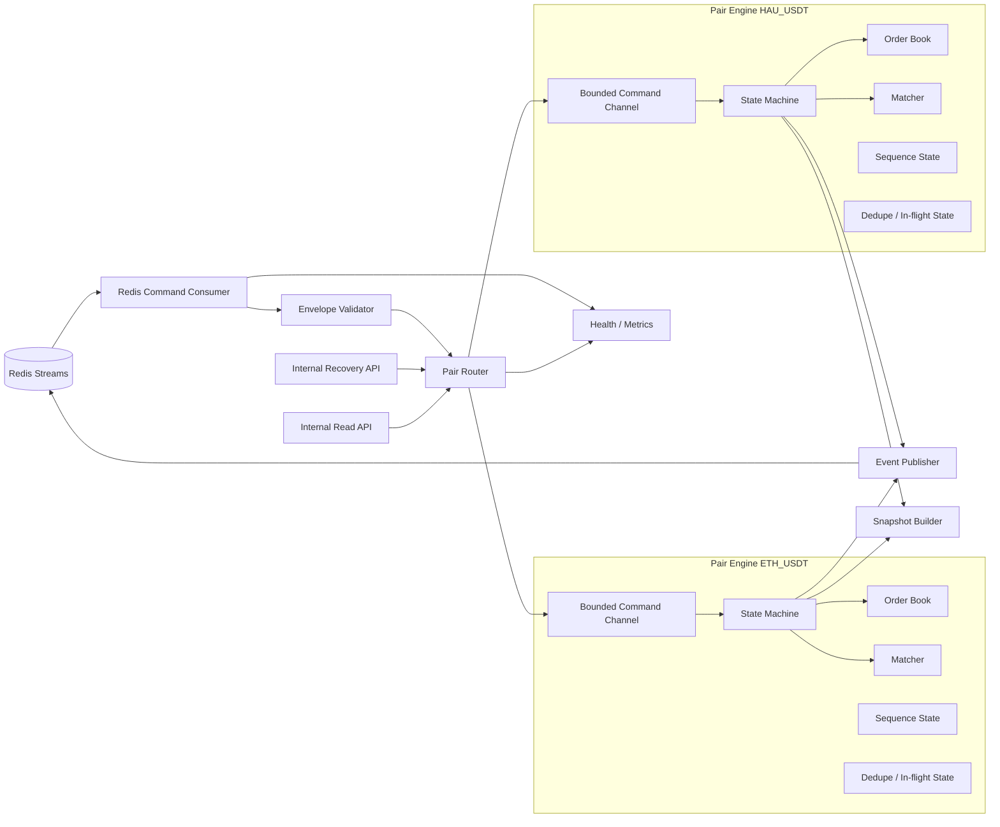
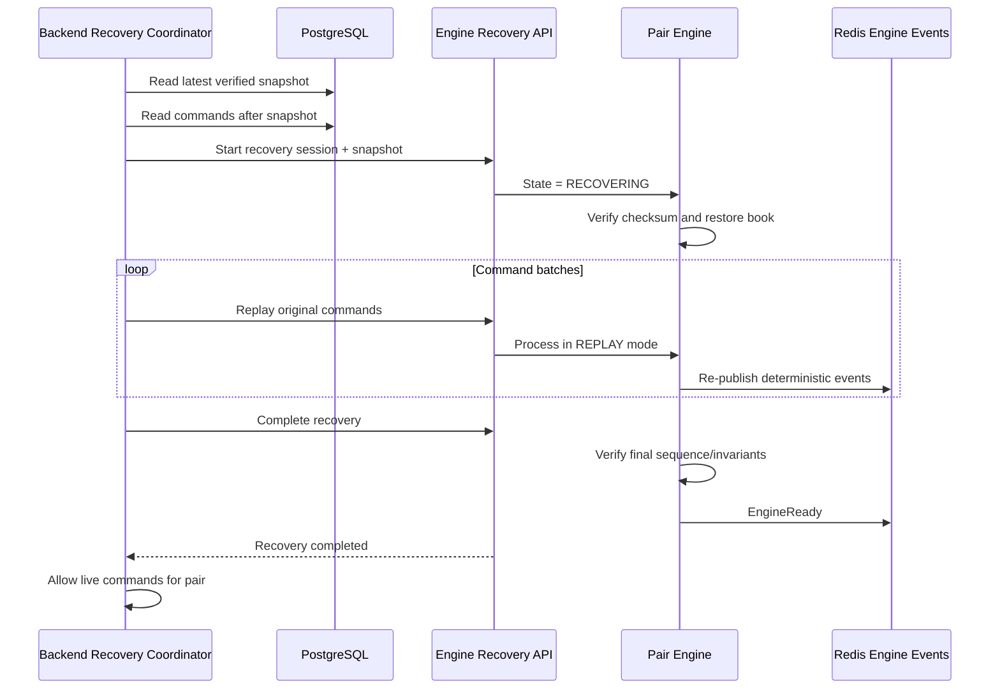

# Hau CEX — Matching Engine Detailed Design

## 1. Mục đích

Tài liệu này mô tả thiết kế chi tiết của Go Matching Engine trong Hau CEX.

Tài liệu là cơ sở trực tiếp để:

- Tổ chức source code Go.
- Xây dựng Pair Engine cho từng Trading Pair.
- Cài đặt in-memory Order Book.
- Cài đặt Price-Time Priority.
- Xử lý `PlaceOrder`, `CancelOrder`, Market Command và Query Command.
- Sinh `TradeCreated`, Order Event và `OrderBookChanged` theo thứ tự xác định.
- Bảo đảm idempotency, deterministic replay và Command Sequence.
- Tạo snapshot và phục hồi Engine sau restart.
- Xây dựng unit test, integration test và benchmark.

Tài liệu này triển khai chi tiết các quy tắc đã chốt trong:

```text
05-business-rules.md
06-system-architecture.md
07-database-design.md
08-api-design.md
09-internal-message-contract.md
```

Khi có khác biệt giữa các tài liệu, quyền sở hữu được xác định theo domain thay vì dùng một thứ tự ghi đè tuyến tính:

```text
Business semantics và invariant nghiệp vụ  → 05 Business Rules
Ranh giới service và nguồn dữ liệu          → 06 System Architecture
Schema, constraint và dữ liệu bền vững      → 07 Database Design
Public REST/WebSocket contract              → 08 API Design
Internal Command/Event schema               → 09 Internal Message Contract
Chi tiết cài đặt bên trong Matching Engine  → 10 Matching Engine Detailed Design
```

File 10 không được tự thay đổi semantics, schema message hoặc quyền sở hữu dữ liệu đã được chốt trong 05–09. Nếu cần mở rộng contract, phải cập nhật tài liệu sở hữu domain tương ứng trước khi implement.

---

# 2. Phạm vi

## 2.1. Trong phạm vi

Matching Engine MVP chịu trách nhiệm:

- Nhận Engine Command từ Redis Streams.
- Quản lý một Pair Engine cho mỗi Trading Pair.
- Validate dữ liệu kỹ thuật của Command.
- Duy trì Order Book trong memory.
- Xử lý Limit Buy và Limit Sell.
- Áp dụng Price-Time Priority.
- Xử lý partial fill và full fill.
- Xử lý hủy Remaining Quantity.
- Sinh Engine Event theo contract 09.
- Quản lý Order Sequence, Command Sequence, Trade Sequence và Order Book Sequence đúng vai trò.
- Tạo deterministic `engineMatchId` và `tradeId`.
- Tạo snapshot tại ranh giới Command.
- Phục hồi từ snapshot và Command Log.
- Cung cấp internal recovery interface.
- Cung cấp read-only Order Book snapshot cho Backend REST API.
- Cung cấp internal diagnostic read không làm thay đổi Command Sequence.
- Cung cấp health, readiness và metrics cơ bản.

## 2.2. Ngoài phạm vi

Matching Engine không chịu trách nhiệm:

- Authentication hoặc authorization.
- Kiểm tra trạng thái User.
- Kiểm tra hoặc khóa Wallet.
- Ghi PostgreSQL trực tiếp.
- Settlement Trade.
- Cập nhật Wallet, Ledger hoặc Treasury Wallet.
- Xử lý Deposit hoặc Withdrawal.
- Phát public/private WebSocket trực tiếp.
- Lấy dữ liệu Binance.
- Market Order, Stop Order, OCO hoặc Iceberg Order.
- Matching on-chain.
- High availability nhiều active writer trong MVP.

---

# 3. Nguyên tắc thiết kế bắt buộc

## 3.1. Một logical writer cho mỗi Trading Pair

Mỗi Trading Pair chỉ có một goroutine được phép mutate trạng thái của Pair Engine:

```text
Một Trading Pair
→ Một Pair Engine
→ Một Goroutine
→ Một Command Channel
→ Một Order Book writer
```

Không goroutine nào khác được sửa trực tiếp:

- Bid Side.
- Ask Side.
- Active Order Index.
- Trade Sequence.
- Order Book Sequence.
- Command Sequence state.
- Snapshot state.

## 3.2. Xử lý tuần tự theo Command Sequence

Mọi Command của cùng Trading Pair được xử lý theo:

```text
commandSequence = lastProcessedCommandSequence + 1
```

Không sử dụng Redis Stream ID hoặc thời gian nhận message để thay thế Command Sequence.

## 3.3. Không sử dụng số thực

Không sử dụng:

```text
float32
float64
```

cho:

- Price.
- Quantity.
- Fee Rate.
- Fee Amount.
- Notional.

MVP sử dụng fixed-point integer với scale chuẩn `18` và `math/big.Int`.

## 3.4. Matching phải deterministic

Với cùng:

- Snapshot.
- Market Config.
- Danh sách Command theo cùng thứ tự.

Engine phải tạo lại cùng:

- Order Book cuối.
- Match order.
- Execution Price.
- Executed Quantity.
- `matchIndex`.
- `engineMatchId`.
- `tradeId`.
- `tradeSequence`.
- Order Book delta về mặt nội dung.

Event `messageId` có thể khác sau process restart vì MVP chưa có durable Engine Event Journal.

## 3.5. Không ACK trước khi Event được publish

Command chỉ được ACK khi:

1. Pair Engine xử lý thành công.
2. Toàn bộ Event Batch được publish thành công lên Redis.
3. Pair Engine đánh dấu Command đã hoàn tất.

Nếu publish Event thất bại:

- Không ACK Command.
- Không xử lý Command tiếp theo của Pair.
- Không mutate lại Command đã áp dụng.
- Retry đúng Event Batch đã tạo.

## 3.6. Engine không truy cập PostgreSQL

Snapshot và Command Log được Backend Recovery Coordinator cung cấp qua internal recovery interface.

Engine không chứa:

- Prisma client.
- PostgreSQL driver.
- SQL query.
- Database credential.

---

# 4. Kiến trúc nội bộ



## 4.1. Thành phần

| Thành phần             | Trách nhiệm                                                              |
| ---------------------- | ------------------------------------------------------------------------ |
| Redis Command Consumer | Đọc `stream:engine:commands` bằng Consumer Group                         |
| Envelope Validator     | Validate envelope, schema version, UUID, decimal string và partition     |
| Pair Router            | Route Command đến đúng Pair Engine                                       |
| Pair Engine            | Sole writer của trạng thái một Trading Pair                              |
| Order Book             | Lưu Price Level và FIFO Order Queue                                      |
| Matcher                | Thực hiện Price-Time Priority                                            |
| Event Factory          | Tạo Event payload theo contract 09                                       |
| Event Publisher        | Publish Event Batch và xử lý retry                                       |
| Snapshot Builder       | Tạo snapshot deterministic và checksum                                   |
| Recovery API           | Nhận snapshot và Command replay từ Backend                               |
| Internal Read API      | Lấy aggregate Order Book snapshot và diagnostic state qua Pair goroutine |
| Health/Metrics         | Liveness, readiness, queue depth, latency và sequence gap                |

---

# 5. Cấu trúc source code Go

```text
matching-engine/
├── cmd/
│   └── engine/
│       └── main.go
├── internal/
│   ├── app/
│   │   ├── app.go
│   │   └── lifecycle.go
│   ├── config/
│   │   └── config.go
│   ├── fixed/
│   │   ├── fixed.go
│   │   ├── parse.go
│   │   └── arithmetic.go
│   ├── message/
│   │   ├── envelope.go
│   │   ├── command.go
│   │   ├── event.go
│   │   └── validation.go
│   ├── engine/
│   │   ├── registry.go
│   │   ├── router.go
│   │   └── state.go
│   ├── pair/
│   │   ├── pair_engine.go
│   │   ├── command_handler.go
│   │   ├── read_handler.go
│   │   ├── sequence.go
│   │   ├── dedupe.go
│   │   └── result.go
│   ├── orderbook/
│   │   ├── order.go
│   │   ├── order_book.go
│   │   ├── side_book.go
│   │   ├── price_level.go
│   │   └── price_heap.go
│   ├── matching/
│   │   ├── matcher.go
│   │   ├── match_result.go
│   │   └── fee.go
│   ├── id/
│   │   ├── trade_id.go
│   │   └── uuid.go
│   ├── publisher/
│   │   ├── event_publisher.go
│   │   └── redis_publisher.go
│   ├── transport/
│   │   ├── redisstream/
│   │   │   ├── consumer.go
│   │   │   ├── decoder.go
│   │   │   └── ack.go
│   │   ├── recoveryhttp/
│   │   │   ├── handler.go
│   │   │   └── dto.go
│   │   └── readhttp/
│   │       ├── handler.go
│   │       └── dto.go
│   ├── snapshot/
│   │   ├── snapshot.go
│   │   ├── canonical.go
│   │   └── checksum.go
│   ├── recovery/
│   │   ├── session.go
│   │   └── replay.go
│   └── observability/
│       ├── logging.go
│       ├── metrics.go
│       └── health.go
├── test/
│   ├── integration/
│   ├── replay/
│   └── fixtures/
├── go.mod
└── Dockerfile
```

## 5.1. Nguyên tắc package

- `orderbook` không biết Redis hoặc HTTP.
- `matching` không biết PostgreSQL hoặc Wallet.
- `pair` điều phối state mutation và Event Batch.
- `transport` chỉ decode/encode và gọi application interface.
- `fixed` là package duy nhất xử lý decimal/fixed-point.
- Không import ngược từ domain package sang transport package.

---

# 6. Trạng thái Engine

## 6.1. Pair Engine State

```go
type PairState string

const (
    PairStateNew        PairState = "NEW"
    PairStateRecovering PairState = "RECOVERING"
    PairStateReady      PairState = "READY"
    PairStateSuspended  PairState = "SUSPENDED"
    PairStateFailed     PairState = "FAILED"
    PairStateStopped    PairState = "STOPPED"
)
```

## 6.2. Chuyển trạng thái

```text
NEW → RECOVERING
NEW → READY                chỉ với Market mới không có lịch sử và OpenMarket hợp lệ

RECOVERING → READY         recovery thành công và Market được mở
RECOVERING → SUSPENDED     recovery thành công nhưng Market đang suspend
RECOVERING → FAILED        snapshot/command log/replay lỗi

READY → SUSPENDED          SuspendMarket
READY → FAILED             sequence gap, publish failure nghiêm trọng, invariant lỗi

SUSPENDED → READY          OpenMarket hợp lệ sau khi config/recovery an toàn
SUSPENDED → FAILED         invariant hoặc recovery lỗi

FAILED → RECOVERING        operator/recovery coordinator bắt đầu phục hồi

* → STOPPED                graceful shutdown
```

## 6.3. Command được phép theo state

| Live Engine Command |     NEW |            RECOVERING |                      READY |                               SUSPENDED |    FAILED |
| ------------------- | ------: | --------------------: | -------------------------: | --------------------------------------: | --------: |
| `OpenMarket`        |      Có | Không qua live stream | Idempotent nếu cùng config |                            Có điều kiện |     Không |
| `SuspendMarket`     |   Không |                 Không |                         Có |                              Idempotent |     Không |
| `PlaceOrder`        | Từ chối |             Không ACK |                         Có |       `OrderRejected(MARKET_SUSPENDED)` | Không ACK |
| `CancelOrder`       | Từ chối |             Không ACK |                         Có | `CancelOrderRejected(MARKET_SUSPENDED)` | Không ACK |
| `CreateSnapshot`    |   Không |                 Không |                         Có |                                      Có |     Không |
| `QueryOrderState`   |   Không |                 Không |                         Có |                                      Có |     Không |

`FAILED` không được tự tiếp tục xử lý mutation Command hoặc ordered live Command.

Read-only operation không đi qua Redis Command Sequence được tách riêng:

| Internal read                   |          NEW | RECOVERING | READY | SUSPENDED | FAILED |
| ------------------------------- | -----------: | ---------: | ----: | --------: | -----: |
| Diagnostic Order State Read     | Có điều kiện |         Có |    Có |        Có |     Có |
| Public Order Book Snapshot Read |        Không |      Không |    Có |        Có |  Không |

Internal read:

- Không tăng `lastProcessedCommandSequence`.
- Không tạo Engine Event trên `stream:engine:events`.
- Không mutate Order Book hoặc sequence state.
- Phải được serialize qua Pair goroutine nếu đọc cấu trúc runtime có thể đang mutate.

---

# 7. Market Config

```go
type MarketConfig struct {
    TradingPairID     string
    Market            string
    BaseAssetID       string
    BaseAssetSymbol   string
    BaseDecimals      uint8
    QuoteAssetID      string
    QuoteAssetSymbol  string
    QuoteDecimals     uint8
    PricePrecision    uint8
    QuantityPrecision uint8
    TickSize          fixed.Value
    StepSize          fixed.Value
    MinimumQuantity   fixed.Value
    MinimumNotional   fixed.Value
    MakerFeeRate      fixed.Value
    TakerFeeRate      fixed.Value
    ConfigHash        string
}
```

## 7.1. Validation

Engine phải kiểm tra:

```text
Base Asset khác Quote Asset
BaseDecimals <= 18
QuoteDecimals <= 18
PricePrecision <= 18
QuantityPrecision <= 18
TickSize > 0
StepSize > 0
MinimumQuantity > 0
MinimumNotional > 0
0 <= MakerFeeRate < 1
0 <= TakerFeeRate < 1
TickSize biểu diễn được bằng scale 18
StepSize biểu diễn được bằng scale 18
```

Engine không tự làm tròn cấu hình sai.

## 7.2. Config Hash

`ConfigHash` dùng SHA-256 trên canonical JSON của Market Config.

Mục đích:

- Phát hiện Backend và Engine dùng config khác nhau.
- So sánh config khi `OpenMarket` được gửi lại.
- Kiểm tra config đã restore trước replay.

`SnapshotCreated v1` phải giữ đúng schema của file 09. Vì contract v1 chưa có field `configHash`, Engine tính lại `ConfigHash` từ `snapshotPayload.marketConfig` sau khi restore; không tự thêm field mới vào message v1.

## 7.3. Hot update và safe transition

Không hot-update matching-critical config khi Pair đang `READY`:

```text
pricePrecision
quantityPrecision
tickSize
stepSize
minimumQuantity
minimumNotional
makerFeeRate
takerFeeRate
assetDecimals
```

Quy tắc `OpenMarket`:

- Pair `READY` + cùng `ConfigHash`: xử lý idempotent, không reset Order Book.
- Pair `READY` + khác `ConfigHash`: từ chối và phát `EngineFailed(MARKET_CONFIG_INVALID)`.
- Pair `SUSPENDED` + cùng `ConfigHash`: cho phép mở lại.
- Pair `SUSPENDED` + khác `ConfigHash`: chỉ cho phép khi đáp ứng toàn bộ safe-transition rule bên dưới.

Safe-transition rule:

1. `tradingPairId`, Base Asset ID, Quote Asset ID và asset decimals không được thay đổi.
2. Nếu thay `pricePrecision`, `quantityPrecision`, `tickSize` hoặc `stepSize`, Order Book phải rỗng.
3. Không tự làm tròn, sửa hoặc di chuyển Open Order cũ sang Price Level mới.
4. `minimumQuantity` và `minimumNotional` mới chỉ áp dụng cho Order tạo sau khi market mở lại.
5. Maker/Taker fee mới chỉ áp dụng cho match tạo sau khi market mở lại; Trade cũ giữ fee rate đã phát trong `TradeCreated`.
6. Config mới phải validate thành công và tạo `ConfigHash` mới ổn định.

Luồng thay đổi:

```text
SuspendMarket
→ verify Pair không có InFlight Command
→ verify safe-transition rule
→ OpenMarket với config mới
```

---

# 8. Fixed-point representation

## 8.1. Scale chuẩn

```text
ENGINE_SCALE = 18
ENGINE_FACTOR = 10^18
```

Mọi Price, Quantity, Fee Rate và Amount trong Engine được biểu diễn bằng integer đã scale 18.

Ví dụ:

```text
"2000.15"
→ 2000150000000000000000

"0.5000"
→ 500000000000000000
```

## 8.2. Kiểu dữ liệu và ownership của `big.Int`

`math/big.Int` chứa backing storage mutable và không được shallow-copy sau khi bắt đầu sử dụng. Vì vậy `Value` lưu con trỏ private, nhưng mọi constructor và phép tính bắt buộc phải tạo bản sao độc lập.

```go
type Value struct {
    n *big.Int
}

func newValue(n *big.Int) Value {
    if n == nil {
        panic("fixed: nil big.Int")
    }

    return Value{
        n: new(big.Int).Set(n),
    }
}

func Zero() Value {
    return newValue(big.NewInt(0))
}

func (v Value) Add(other Value) Value {
    result := new(big.Int).Add(v.n, other.n)
    return newValue(result)
}
```

Quy tắc bắt buộc:

- Field `n` không được export.
- Không có method nào trả trực tiếp `v.n` hoặc pointer tham chiếu backing storage bên trong.
- Mọi constructor nhận `*big.Int` phải dùng `new(big.Int).Set(input)`.
- Mọi phép tính phải dùng một destination mới, ví dụ `new(big.Int).Add(...)`; không dùng `v.n` hoặc `other.n` làm destination.
- Method trả `Value` phải có ownership độc lập; caller không thể mutate operand thông qua result.
- Method chỉ đọc như `Cmp`, `Sign` hoặc `String` không được mutate receiver.
- Zero value `Value{}` không được coi là giá trị hợp lệ; constructor và parser là đường tạo Value hợp lệ.
- Không dùng chung mutable `*big.Int` giữa Order, Price Level, Event payload hoặc snapshot object.

Ví dụ interface:

```go
type Value struct {
    n *big.Int
}

func ParseStrict(input string) (Value, error)
func Zero() Value
func One() Value

func (v Value) Add(other Value) Value
func (v Value) Sub(other Value) (Value, error)
func (v Value) Cmp(other Value) int
func (v Value) IsZero() bool
func (v Value) IsPositive() bool
func (v Value) Mod(other Value) Value
func (v Value) MulDown(other Value) Value
func (v Value) QuantizeDown(decimals uint8) Value
func (v Value) String() string
func (v Value) IntegerKey() string
```

Unit test bắt buộc phải giữ bản sao chuỗi của operand trước phép tính, thực hiện phép tính, rồi xác nhận operand không bị mutate. Test cũng phải truyền một `*big.Int` vào constructor, mutate input sau đó và xác nhận `Value` không thay đổi.

## 8.3. Parse strict

Chấp nhận:

```text
0
1
1.25
2000.150000000000000000
```

Từ chối:

```text
+1
-1
1e-3
NaN
Infinity
1.
.5
00
01
01.2
quá 18 chữ số thập phân
vượt NUMERIC(38,18)
```

Canonical decimal policy được chốt dứt khoát:

- Không có leading zero, ngoại trừ chính giá trị `0` hoặc phần nguyên `0` của số nhỏ hơn 1.
- Không có trailing decimal point.
- Không có dấu `+`.
- Không dùng scientific notation.
- Zero luôn serialize thành `"0"`.
- Decimal payload phải được parse rồi normalize trước khi canonical JSON, payload hash hoặc snapshot checksum được tính.
- Go và TypeScript phải dùng cùng test vector canonicalization; producer không được hash raw input chưa normalize.

## 8.4. Phép nhân ROUND_DOWN

Với hai số scale 18:

```text
result = floor(a × b / 10^18)
```

Dùng cho:

```text
notional = executionPrice × executedQuantity
fee = feeBase × feeRate
```

## 8.5. Làm tròn theo Asset Decimals

```text
quantized = floor(value / 10^(18-decimals)) × 10^(18-decimals)
```

Buyer Fee:

```text
buyerFee = ROUND_DOWN(executedQuantity × buyerFeeRate, baseAsset.decimals)
```

Seller Fee:

```text
quoteAmount = ROUND_DOWN(executionPrice × executedQuantity, quoteAsset.decimals)
sellerFee = ROUND_DOWN(quoteAmount × sellerFeeRate, quoteAsset.decimals)
```

Settlement Backend phải tính lại và verify các giá trị này.

## 8.6. Tick Size và Step Size

```text
price mod tickSize = 0
quantity mod stepSize = 0
```

Engine kiểm tra lại để bảo vệ contract nhưng không thay thế validation của Backend.

---

# 9. Định danh deterministic

## 9.1. Engine Match ID

```text
engineMatchId = tradingPairId + ":" + commandSequence + ":" + matchIndex
```

Trong đó:

- `matchIndex` bắt đầu từ `0` cho từng `PlaceOrder`.
- Tăng đúng một lần cho mỗi resting Order được match.
- Không phụ thuộc thời gian hệ thống.
- Không phụ thuộc Event `messageId`.

## 9.2. Trade namespace

Giá trị cố định:

```text
HAU_CEX_TRADE_NAMESPACE = 621cd174-d823-54a4-a9d5-85d3e2a4912d
```

Namespace này được tạo một lần theo:

```text
UUIDv5(UUID_NAMESPACE_URL, "https://hau-cex.local/namespaces/trade")
```

Giá trị constant phải giống nhau trong mọi environment:

```go
const HauCEXTradeNamespace = "621cd174-d823-54a4-a9d5-85d3e2a4912d"
```

```ts
export const HAU_CEX_TRADE_NAMESPACE = "621cd174-d823-54a4-a9d5-85d3e2a4912d";
```

Không tạo namespace khác cho local, staging hoặc production demo.

## 9.3. Trade ID

```text
tradeId = UUIDv5(HAU_CEX_TRADE_NAMESPACE, engineMatchId)
```

Contract test bắt buộc xác nhận Go và TypeScript tạo cùng UUID.

Ví dụ test vector:

```text
namespace:
621cd174-d823-54a4-a9d5-85d3e2a4912d

name:
0197-pair-id:1051:0

expectedTradeId:
f36dab41-fa29-5bc4-af53-6ec8c01325c1
```

Giá trị trên phải được xác minh bằng test độc lập ở cả Go và TypeScript.

## 9.4. Event Message ID

- Event `messageId` dùng UUIDv7.
- Trong cùng process retry Event Batch phải giữ nguyên Event `messageId`.
- Sau process restart, replay có thể tạo Event `messageId` mới.
- `tradeId` và `engineMatchId` không được thay đổi.

---

# 10. Logical clock và timestamp deterministic

## 10.1. Vấn đề

Nếu `matchedAt` dùng `time.Now()` thì replay cùng Command sẽ tạo payload khác và có thể gây conflict với Trade đã settlement.

## 10.2. Quyết định

Mỗi Command có một logical time ổn định:

```text
logicalCommandTime = envelope.occurredAt
```

Các timestamp nghiệp vụ trong Event payload phải dẫn xuất từ Command gốc:

| Event field          | Nguồn thời gian                                             |
| -------------------- | ----------------------------------------------------------- |
| `acceptedAt`         | `logicalCommandTime`                                        |
| `openedAt`           | `logicalCommandTime`                                        |
| `matchedAt`          | `logicalCommandTime`                                        |
| `updatedAt`          | `logicalCommandTime`                                        |
| `filledAt`           | `logicalCommandTime`                                        |
| `cancelledAt`        | `CancelOrder.requestedAt`, fallback `logicalCommandTime`    |
| `changedAt`          | `logicalCommandTime`                                        |
| Snapshot `createdAt` | `CreateSnapshot.requestedAt`, fallback `logicalCommandTime` |

Event envelope `occurredAt` là thời điểm Event instance được tạo/publish và có thể khác sau replay.

Business payload của `TradeCreated` phải deterministic.

---

# 11. Cấu trúc Order runtime

```go
type Side string

const (
    SideBuy  Side = "BUY"
    SideSell Side = "SELL"
)

type RuntimeOrderStatus string

const (
    RuntimeOrderOpen            RuntimeOrderStatus = "OPEN"
    RuntimeOrderPartiallyFilled RuntimeOrderStatus = "PARTIALLY_FILLED"
    RuntimeOrderFilled          RuntimeOrderStatus = "FILLED"
    RuntimeOrderCancelled       RuntimeOrderStatus = "CANCELLED"
)

type Order struct {
    ID                string
    UserID            string
    TradingPairID     string
    Side              Side
    Type              string
    Price             fixed.Value
    OriginalQuantity  fixed.Value
    FilledQuantity    fixed.Value
    RemainingQuantity fixed.Value
    OrderSequence     uint64
    CreatedAt         time.Time
    Status            RuntimeOrderStatus
}
```

## 11.1. Invariant

```text
OriginalQuantity = FilledQuantity + RemainingQuantity
FilledQuantity >= 0
RemainingQuantity >= 0
OrderSequence > 0
Price > 0
OriginalQuantity > 0
```

## 11.2. Engine không lưu Wallet state

Order runtime không chứa:

- Available Balance.
- Locked Balance.
- Remaining Locked Amount.
- Ledger state.

Các giá trị này thuộc Backend/PostgreSQL.

---

# 12. Cấu trúc Order Book

## 12.1. Tổng quan

```go
type OrderBook struct {
    Bids *SideBook
    Asks *SideBook

    ActiveOrders map[string]*OrderNode
    Tombstones   *TombstoneStore
}
```

## 12.2. Side Book

```go
type SideBook struct {
    Side       Side
    Levels     map[string]*PriceLevel
    PriceHeap  PriceHeap
}
```

- Bid Heap là max-heap.
- Ask Heap là min-heap.
- Map key là `price.IntegerKey()`.
- Không dùng pointer `big.Int` làm map key.

## 12.3. Price Level

```go
type PriceLevel struct {
    Price         fixed.Value
    Orders        *list.List
    TotalQuantity fixed.Value
    OrderCount    int
    HeapIndex     int
}
```

Mỗi Price Level duy trì FIFO bằng `container/list`.

## 12.4. Order Node

```go
type OrderNode struct {
    Order   *Order
    Level   *PriceLevel
    Element *list.Element
}
```

`ActiveOrders[orderId]` cho phép:

- Tìm Order O(1).
- Cancel O(1) trong linked list.
- Xóa Price Level rỗng O(log P) khỏi heap.

## 12.5. Độ phức tạp

| Thao tác                | Độ phức tạp                    |
| ----------------------- | ------------------------------ |
| Best Bid/Ask            | O(1)                           |
| Tạo Price Level         | O(log P)                       |
| Thêm Order cuối FIFO    | O(1) sau khi tìm level         |
| Lấy Maker đầu level     | O(1)                           |
| Xóa Order theo ID       | O(1) + O(log P) nếu level rỗng |
| Match một resting Order | O(1) + O(log P) nếu xóa level  |
| Snapshot toàn book      | O(O + P log P)                 |

Trong đó:

```text
P = số Price Level
O = số Active Order
```

## 12.6. Price Heap

Không dùng lazy deletion cho MVP.

Mỗi `PriceLevel` giữ `HeapIndex` để:

- `heap.Remove` khi Price Level rỗng.
- Không tích lũy stale level.
- Dễ kiểm tra invariant.

## 12.7. FIFO

Order trong cùng Price Level được xếp theo `orderSequence` tăng dần.

Trong live processing, Backend đã cấp Order Sequence tăng dần nên Order mới thường append cuối.

Trong recovery, khi restore snapshot hoặc replay:

- Validate Order Sequence tăng dần trong từng Price Level.
- Nếu không tăng dần, snapshot/replay bị từ chối.

---

# 13. Tombstone và trạng thái Order đã kết thúc

## 13.1. Mục đích

Sau khi Order bị `FILLED` hoặc `CANCELLED`, Order không còn trong Active Order Index.

Tombstone giúp Engine trả kết quả chính xác hơn cho Cancel retry:

```text
ORDER_ALREADY_FILLED
ORDER_ALREADY_CANCELLED
```

## 13.2. Cấu trúc

```go
type Tombstone struct {
    OrderID              string
    FinalStatus          RuntimeOrderStatus
    FinalFilledQuantity  fixed.Value
    FinalRemaining       fixed.Value
    FinalCommandSequence uint64
}
```

## 13.3. Retention và persistence

MVP giữ tombstone trong memory theo cấu hình:

```text
maxTombstonesPerPair: 100000
maxCommandDistance:   100000
```

Trong `SnapshotCreated v1`, tombstone không được persist trong snapshot vì contract 09 chưa định nghĩa field này.

Sau restart, Engine có thể không phân biệt được Order đã `FILLED`, `CANCELLED` hay chưa từng tồn tại nếu Order không còn active và tombstone memory đã mất. Trong trường hợp đó Engine trả:

```text
ORDER_NOT_FOUND
```

Backend bắt buộc suspend Trading Pair và thực hiện reconciliation; không được tự mở khóa số dư hoặc tự suy luận trạng thái PostgreSQL.

Muốn persist tombstone phải cập nhật schema `SnapshotCreated` trong file 09 và nâng version contract rõ ràng trước khi triển khai.

Tombstone là bounded diagnostic state trong memory, không phải nguồn tài chính chính.

---

# 14. Pair Engine

```go
type PairEngine struct {
    ID         string
    Market     string
    State      PairState
    Config     MarketConfig
    OrderBook  *orderbook.OrderBook

    LastProcessedCommandSequence uint64
    LastOrderSequence            uint64
    LastTradeSequence            uint64
    BookSequence                 uint64
    LastSnapshotCommandSequence  uint64

    CommandCh chan CommandTask

    InFlight       *InFlightCommand
    RecentCommands *CommandDedupeStore

    Publisher EventPublisher
    Clock     Clock
}
```

## 14.1. Command Task

```go
type CommandTask struct {
    Envelope MessageEnvelope
    Ack      func(context.Context) error
    ResultCh chan<- ProcessResult
    Mode     ProcessingMode
}
```

```go
type ProcessingMode string

const (
    ProcessingModeLive   ProcessingMode = "LIVE"
    ProcessingModeReplay ProcessingMode = "REPLAY"
)
```

## 14.2. Goroutine loop

```go
func (p *PairEngine) Run(ctx context.Context) {
    for {
        select {
        case <-ctx.Done():
            p.gracefulStop()
            return

        case task := <-p.CommandCh:
            p.handleTask(ctx, task)
        }
    }
}
```

Không chạy `handleTask` bằng goroutine khác.

## 14.3. Bounded channel

Giá trị khởi đầu:

```text
pairCommandBuffer = 1024
```

Nếu channel đầy:

- Router chờ.
- Không drop Command.
- Không ACK sớm.
- Tạo backpressure lên Redis Consumer.

MVP chấp nhận một Pair quá tải có thể tạo global backpressure vì chỉ có một active Redis consumer. Tối ưu partitioned stream là future scope.

---

# 15. Command Sequence và dedupe

## 15.1. Sequence decision

```go
type SequenceDecision string

const (
    SequenceExpected  SequenceDecision = "EXPECTED"
    SequenceDuplicate SequenceDecision = "DUPLICATE"
    SequenceGap       SequenceDecision = "GAP"
    SequenceConflict  SequenceDecision = "CONFLICT"
)
```

## 15.2. Expected Command

```text
commandSequence = lastProcessedCommandSequence + 1
```

Engine xử lý Command.

## 15.3. Duplicate Command

```text
commandSequence <= lastProcessedCommandSequence
```

Xử lý:

1. Tìm fingerprint theo `commandSequence` hoặc `messageId`.
2. Nếu payload hash khác dữ liệu đã biết: Pair `FAILED` với `DUPLICATE_COMMAND_CONFLICT`.
3. Nếu Command đang `InFlight` và Event chưa publish: retry Event Batch cũ.
4. Nếu Event đã publish nhưng ACK thất bại: không mutate, chỉ ACK lại.
5. Nếu Command được snapshot bao phủ và không còn fingerprint: ACK duplicate an toàn dựa trên nguồn Command Log bền vững và unique `(partitionKey, commandSequence)` phía Backend.

## 15.4. Sequence Gap

```text
commandSequence > lastProcessedCommandSequence + 1
```

Xử lý:

- Không ACK Command hiện tại.
- Không mutate Order Book.
- Không phát `OrderRejected` hoặc `CancelOrderRejected`.
- Phát `EngineFailed(COMMAND_SEQUENCE_GAP)`.
- Pair chuyển `FAILED`.
- Command hiện tại giữ pending trong Redis.
- Backend Recovery Coordinator replay Command bị thiếu.
- Chỉ quay lại live processing sau recovery thành công.

## 15.5. Fingerprint

```text
fingerprint = SHA-256(canonical command payload + messageType + version)
```

`RecentCommands` lưu tối thiểu:

```go
type ProcessedCommand struct {
    MessageID       string
    MessageType     string
    CommandSequence uint64
    PayloadHash     string
    EventBatchHash  string
    EventsPublished bool
}
```

Các fingerprint sau snapshot gần nhất phải được giữ hoặc tái tạo bằng replay.

---

# 16. In-flight Command và publish safety

## 16.1. Vấn đề dual-write trong Engine

Engine mutate memory và publish Redis Event không nằm trong distributed transaction.

## 16.2. In-flight state

```go
type InFlightCommand struct {
    MessageID       string
    CommandSequence uint64
    PayloadHash     string
    EventBatch      []MessageEnvelope
    Applied         bool
    Published       bool
}
```

## 16.3. Quy trình

```text
1. Validate envelope, sequence và payload.
2. Tính Match Result trong Pair goroutine.
3. Mutate Order Book và các runtime counter cần thiết.
4. Tạo Event Batch và gán UUIDv7 messageId một lần.
5. Lưu InFlight trong memory.
6. Publish toàn bộ Event Batch.
7. Sau khi publish thành công:
   - đánh dấu InFlight Published;
   - lastProcessedCommandSequence = commandSequence;
   - cập nhật LastOrderSequence nếu Command là PlaceOrder;
   - cập nhật LastSnapshotCommandSequence nếu Command là CreateSnapshot;
   - ghi RecentCommands.
8. Clear InFlight.
9. Trả kết quả để Redis Consumer ACK Command.
```

Quy tắc counter:

- `LastOrderSequence` là Order Sequence lớn nhất Engine đã tiếp nhận hợp lệ về contract, kể cả Order sau đó bị Engine reject trước khi vào book.
- `LastTradeSequence` tăng đúng một lần cho mỗi match trong mutation deterministic.
- `BookSequence` tăng đúng một lần cho mỗi Command làm thay đổi Order Book.
- Nếu process chết trước publish, memory và counter chưa bền vững bị mất; recovery phải tái tạo lại từ snapshot + Command Log.

## 16.4. Publish Event Batch

Sử dụng Redis `MULTI/EXEC` hoặc `TxPipeline` để append toàn bộ Event Batch:

```text
MULTI
XADD stream:engine:events ... Event 1
XADD stream:engine:events ... Event 2
...
EXEC
```

Lợi ích:

- Event trong một Command được append như một batch Redis transaction.
- Không có Command khác của cùng Pair chen vào giữa vì Pair goroutine chờ publish.
- Nếu client không biết `EXEC` đã thành công do network timeout, retry cùng Event Batch với cùng `messageId`.
- Consumer Backend xử lý duplicate bằng idempotency.

## 16.5. Publish failure

Nếu publish chưa thành công:

- Giữ `InFlight`.
- Pair không xử lý Command sau.
- Retry exponential backoff.
- Sau ngưỡng cấu hình, phát cảnh báo `EVENT_PUBLISH_FAILED` qua kênh vận hành nếu có thể.
- Không rollback in-memory mutation bằng cách tự suy luận ngược.
- Nếu process chết, recovery từ snapshot + Command Log sẽ tái tạo trạng thái.

---

# 17. Event ordering trong một Command

## 17.1. PlaceOrder Event Batch

Thứ tự bắt buộc:

```text
1. OrderAccepted
2. TradeCreated[matchIndex = 0..n-1]
3. Runtime Order Status Events cho resting Order theo thứ tự match
4. Runtime Order Status Event cuối của incoming Order
5. OrderOpened nếu incoming còn Remaining Quantity và được đưa vào Order Book
6. OrderBookChanged nếu Order Book thay đổi
```

Quy tắc:

- Mỗi resting Order chỉ phát một runtime status cuối trong Command.
- Incoming Order chỉ phát một runtime status cuối trong Command.
- `TradeCreated` luôn theo `matchIndex` tăng dần.
- `OrderBookChanged` luôn là Event cuối cùng liên quan tới book của Command.

Ví dụ incoming Buy khớp hai Sell và còn dư:

```text
OrderAccepted(incoming)
TradeCreated(matchIndex=0)
TradeCreated(matchIndex=1)
OrderFilled(resting-1)
OrderFilled(resting-2)
OrderPartiallyFilled(incoming)
OrderOpened(incoming remainder)
OrderBookChanged
```

## 17.2. PlaceOrder không match

```text
OrderAccepted
OrderOpened
OrderBookChanged
```

## 17.3. PlaceOrder bị từ chối

```text
OrderRejected
```

Không phát `OrderAccepted` trước `OrderRejected` nếu validation thất bại trước mutation.

## 17.4. CancelOrder thành công

```text
OrderCancelled
OrderBookChanged
```

## 17.5. CancelOrder thất bại

```text
CancelOrderRejected
```

## 17.6. Snapshot

```text
SnapshotCreated
```

## 17.7. Market command

```text
OpenMarket    → MarketOpened hoặc EngineFailed
SuspendMarket → MarketSuspended hoặc EngineFailed
```

## 17.8. QueryOrderState

```text
QueryOrderState → OrderStateReported hoặc EngineFailed
```

`OrderStateReported` là Engine Event theo contract 09 và phải được publish thành công trước khi ACK `QueryOrderState`.

---

# 18. Thuật toán PlaceOrder

## 18.1. Input

```text
PlaceOrder Command
Market Config
Current Pair State
Current Order Book
```

## 18.2. Validation

Engine kiểm tra:

- Pair `READY`.
- Command Sequence expected.
- `orderId` không active.
- Không conflict với tombstone/dedupe.
- `orderSequence > 0`.
- `orderSequence > LastOrderSequence` với Order mới.
- `type = LIMIT`.
- Side hợp lệ.
- Price và Quantity parse được.
- Price/Quantity dương.
- Tick Size và Step Size hợp lệ.
- Minimum Quantity và Minimum Notional hợp lệ.

Backend đã validate trước nhưng Engine vẫn kiểm tra contract-level invariant.

## 18.3. Pseudocode

```text
handlePlaceOrder(command):
    validateStateAndSequence(command)
    validateMarketConfig(command)
    validateOrder(command)

    incoming = new RuntimeOrder(command)
    events = [OrderAccepted(incoming)]
    changedBidLevels = set()
    changedAskLevels = set()
    touchedOrders = ordered map()
    matchIndex = 0

    while incoming.remainingQuantity > 0:
        maker = orderBook.bestOppositeOrder(incoming.side)

        if maker == nil:
            break

        if not pricesCross(incoming, maker):
            break

        executedQuantity = min(
            incoming.remainingQuantity,
            maker.remainingQuantity
        )

        executionPrice = maker.price

        update incoming quantity
        update maker quantity
        update price-level aggregate

        tradeSequence = lastTradeSequence + 1
        engineMatchId = pairId + ":" + commandSequence + ":" + matchIndex
        tradeId = uuidV5(TRADE_NAMESPACE, engineMatchId)

        events.append(TradeCreated(...))
        touchedOrders.addOrReplace(maker final runtime status)
        matchIndex++
        lastTradeSequence++

        if maker.remainingQuantity == 0:
            remove maker from book
            create FILLED tombstone

    if incoming.remainingQuantity > 0:
        add incoming to own side book
        touchedOrders.addOrReplace(incoming final runtime status)
        events.append(OrderOpened(incoming))
    else:
        create FILLED tombstone for incoming
        touchedOrders.addOrReplace(incoming FILLED)

    events.insert runtime statuses after all TradeCreated

    if book changed:
        bookSequence++
        events.append(OrderBookChanged(current aggregate of touched levels))

    publish events
    complete command
```

## 18.4. Điều kiện cross

Incoming BUY:

```text
incoming.price >= bestAsk.price
```

Incoming SELL:

```text
incoming.price <= bestBid.price
```

## 18.5. Maker/Taker

```text
maker = resting Order
taker = incoming Order
executionPrice = maker.price
```

## 18.6. Fee rate

Buyer/Seller fee rate được xác định theo vai trò Maker/Taker:

```text
buyerFeeRate = makerFeeRate nếu Buy Order là Maker
buyerFeeRate = takerFeeRate nếu Buy Order là Taker

sellerFeeRate = makerFeeRate nếu Sell Order là Maker
sellerFeeRate = takerFeeRate nếu Sell Order là Taker
```

## 18.7. Self-trade

MVP chưa có rule cấm self-trade.

Engine không tự chặn:

```text
buyerId == sellerId
```

Muốn chặn phải bổ sung Business Rule trước.

---

# 19. Thuật toán CancelOrder

## 19.1. Validation

- Command Sequence expected.
- Pair `READY`.
- `requestedBy = USER` trong MVP.
- Order tồn tại trong Active Order Index hoặc tombstone.

## 19.2. Pseudocode

```text
handleCancelOrder(command):
    validateStateAndSequence(command)

    node = activeOrders[command.orderId]

    if node == nil:
        tombstone = tombstones[command.orderId]

        if tombstone.status == FILLED:
            emit CancelOrderRejected(ORDER_ALREADY_FILLED)
            return

        if tombstone.status == CANCELLED:
            emit CancelOrderRejected(ORDER_ALREADY_CANCELLED)
            return

        emit CancelOrderRejected(ORDER_NOT_FOUND)
        return

    cancelledQuantity = node.order.remainingQuantity
    finalFilledQuantity = node.order.filledQuantity

    remove node from Price Level
    remove from Active Order Index
    update aggregate
    create CANCELLED tombstone

    emit OrderCancelled(
        cancelledQuantity,
        finalFilledQuantity,
        engineActiveQuantity = 0
    )

    increment bookSequence
    emit OrderBookChanged(current aggregate of changed level)
```

## 19.3. Pair SUSPENDED

Engine phát:

```text
CancelOrderRejected(reasonCode = MARKET_SUSPENDED)
```

Không mutate Order Book.

Backend giữ Order `CANCEL_PENDING` và thực hiện query/reconciliation theo contract 09.

## 19.4. Race với matching

Vì `PlaceOrder` và `CancelOrder` đi qua cùng Pair Engine:

- Nếu match command xử lý trước, phần đã khớp hợp lệ.
- Cancel chỉ loại Remaining Quantity còn tại thời điểm Cancel tới lượt.
- Nếu Remaining Quantity đã bằng 0, trả `ORDER_ALREADY_FILLED`.

---

# 20. QueryOrderState

## 20.1. Mục đích

`QueryOrderState` là ordered Engine Command theo contract 09, hỗ trợ Backend xử lý:

- Order `PENDING` quá lâu.
- Cancel response muộn.
- Reconciliation khi Backend cần xác minh trạng thái runtime theo đúng Command Sequence.

Command này chỉ được xử lý qua live stream khi Pair ở `READY` hoặc `SUSPENDED`.

## 20.2. Event `OrderStateReported`

Engine phải phát đúng event v1:

```json
{
  "sourceCommandId": "0197...",
  "commandSequence": "1055",
  "tradingPairId": "0197...",
  "market": "ETH_USDT",
  "orderId": "0197...",
  "found": true,
  "engineStatus": "OPEN",
  "filledQuantity": "0",
  "remainingQuantity": "0.500000000000000000",
  "lastProcessedCommandSequence": "1055",
  "reportedAt": "2026-07-01T10:36:00.000Z"
}
```

Nếu Active Order tồn tại:

```text
found = true
engineStatus = OPEN hoặc PARTIALLY_FILLED
filledQuantity = runtime Order filled quantity
remainingQuantity = runtime Order remaining quantity
```

Nếu tombstone tồn tại:

```text
found = true
engineStatus = FILLED hoặc CANCELLED
filledQuantity = tombstone final filled quantity
remainingQuantity = tombstone final remaining quantity
```

Nếu không tồn tại:

```text
found = false
engineStatus = NOT_FOUND
filledQuantity = "0"
remainingQuantity = "0"
```

Không thêm field `orderSequence` vào `OrderStateReported v1` vì contract 09 chưa định nghĩa field này.

## 20.3. Sequence và mutation

`QueryOrderState`:

- Không mutate Order Book.
- Không tăng Book Sequence hoặc Trade Sequence.
- Vẫn là một ordered Command, vì vậy sau khi event publish thành công phải cập nhật `lastProcessedCommandSequence = commandSequence`.
- `lastProcessedCommandSequence` trong payload phải phản ánh sequence của chính `QueryOrderState` đang được hoàn tất.

## 20.4. Internal diagnostic read

Khi Pair ở `RECOVERING` hoặc `FAILED`, công cụ vận hành có thể dùng internal diagnostic read riêng:

```http
GET /internal/v1/diagnostics/markets/:tradingPairId/orders/:orderId
```

Diagnostic read:

- Không phải `QueryOrderState` Command.
- Không có Command Sequence.
- Không phát `OrderStateReported`.
- Không ACK Redis message.
- Không thay đổi state hoặc counter.
- Chỉ phục vụ điều tra/recovery control trong private network.

# 21. OpenMarket và SuspendMarket

## 21.1. OpenMarket

### Market mới

Điều kiện:

- Pair chưa có state bền vững.
- Command Sequence là sequence đầu tiên trong Command Log, thông thường `1`.
- Config hợp lệ.

Xử lý:

```text
create Pair Engine
store config
initialize empty Order Book
lastTradeSequence = 0
bookSequence = 0
state = READY
emit MarketOpened
```

### Market đã có lịch sử

Pair phải recovery trước khi chuyển `READY`.

`OpenMarket` không được bỏ qua snapshot hoặc command replay.

### Mở lại Market SUSPENDED

- Validate toàn bộ config và tính `ConfigHash`.
- Nếu cùng `ConfigHash`, mở lại idempotent và giữ nguyên Order Book.
- Nếu config thay đổi, áp dụng toàn bộ safe-transition rule ở mục 7.3.
- Nếu thay precision/tick/step khi Order Book chưa rỗng, từ chối bằng `EngineFailed(MARKET_CONFIG_INVALID)`.
- Không làm mất, tự làm tròn hoặc thay thứ tự Open Order.
- Chuyển `SUSPENDED → READY` chỉ sau khi config mới được chấp nhận.
- Emit `MarketOpened`.

## 21.2. SuspendMarket

Xử lý tại ranh giới Command:

```text
state = SUSPENDED
không xóa Open Order
không tạo Trade mới sau command này
emit MarketSuspended
```

Các Order đã match bởi Command trước đó vẫn hợp lệ.

---

# 22. Order Book Change aggregation

## 22.1. Changed Level Set

Trong mỗi mutation Command, Pair Engine theo dõi Price Level bị thay đổi:

```go
type ChangedLevels struct {
    BidKeys map[string]struct{}
    AskKeys map[string]struct{}
}
```

## 22.2. Delta cuối Command

Event chỉ chứa trạng thái cuối của từng Price Level:

```text
totalQuantity hiện tại
orderCount hiện tại
```

Không gửi lượng cộng/trừ.

Nếu level bị xóa:

```json
{
  "price": "1999.000000000000000000",
  "totalQuantity": "0",
  "orderCount": 0
}
```

## 22.3. Deterministic ordering

Trong payload:

- `bids` sort Price giảm dần.
- `asks` sort Price tăng dần.

## 22.4. Book Sequence

Chỉ tăng một lần cho mỗi Command làm thay đổi Order Book:

```text
previousBookSequence = current bookSequence
bookSequence++
```

Không tăng cho:

- Order bị reject trước mutation.
- Cancel bị reject.
- QueryOrderState.
- MarketOpened.
- MarketSuspended.
- Snapshot không thay đổi book.

## 22.5. Read-only Order Book snapshot cho Public API

Public Order Book snapshot khác Engine recovery snapshot.

```text
Public Order Book Snapshot
- Price Level đã aggregate.
- Giới hạn theo depth.
- Không chứa User ID hoặc Order ID.
- Dùng đồng bộ REST snapshot + WebSocket delta.

Engine Recovery Snapshot
- Chứa từng active Order.
- Chứa sequence và Market Config.
- Dùng restore Pair Engine.
```

Backend lấy snapshot qua internal read API:

```http
GET /internal/v1/markets/:tradingPairId/order-book?depth=20
```

Response:

```json
{
  "market": "ETH_USDT",
  "sequence": "8452",
  "bids": [
    {
      "price": "2000.000000000000000000",
      "totalQuantity": "3.500000000000000000",
      "orderCount": 2
    }
  ],
  "asks": [],
  "generatedAt": "2026-07-01T10:30:00.000Z"
}
```

Yêu cầu:

1. HTTP handler không được đọc trực tiếp map, heap hoặc linked list đang bị Pair goroutine mutate.
2. Request được chuyển thành read task qua Pair goroutine.
3. `bids`, `asks` và `sequence` phải được chụp trong cùng một logical read.
4. `depth` mặc định `20`, tối đa `100`, phù hợp public API file 08.
5. `bids` sort giá giảm dần; `asks` sort giá tăng dần.
6. Read không tăng Book Sequence hoặc Command Sequence.
7. Chỉ phục vụ Pair `READY` hoặc `SUSPENDED`; trạng thái khác trả lỗi internal tương ứng.

---

# 23. Snapshot design

## 23.1. Thời điểm snapshot

Snapshot chỉ được tạo:

- Sau khi toàn bộ Command trước đã xử lý.
- Sau khi Event Batch của Command trước đã publish thành công.
- Khi không có `InFlight` chưa publish.
- Tại ranh giới giữa hai Command.

`CreateSnapshot` là một Command có Command Sequence.

Snapshot metadata có:

```text
lastCommandSequence = commandSequence của CreateSnapshot
```

## 23.2. `SnapshotCreated v1`

File 10 phải phát đúng schema file 09; metadata nằm ngoài `snapshotPayload`:

```json
{
  "sourceCommandId": "0197...",
  "commandSequence": "1054",
  "snapshotId": "0197...",
  "tradingPairId": "0197...",
  "market": "ETH_USDT",
  "lastCommandSequence": "1054",
  "lastOrderSequence": "880",
  "lastTradeSequence": "1201",
  "snapshotVersion": 1,
  "orderCount": 25,
  "checksum": "lowercase-sha256",
  "snapshotPayload": {
    "engineState": "READY",
    "bookSequence": "8452",
    "marketConfig": {
      "tradingPairId": "0197...",
      "market": "ETH_USDT",
      "baseAsset": {
        "id": "0197...",
        "symbol": "ETH",
        "decimals": 18
      },
      "quoteAsset": {
        "id": "0197...",
        "symbol": "USDT",
        "decimals": 18
      },
      "pricePrecision": 2,
      "quantityPrecision": 4,
      "tickSize": "0.010000000000000000",
      "stepSize": "0.000100000000000000",
      "minimumQuantity": "0.001000000000000000",
      "minimumNotional": "10.000000000000000000",
      "makerFeeRate": "0.0010000000",
      "takerFeeRate": "0.0015000000"
    },
    "bids": [],
    "asks": []
  },
  "createdAt": "2026-07-01T10:35:00.000Z"
}
```

Không tự thêm các field sau vào `SnapshotCreated v1` khi file 09 chưa nâng version:

```text
configHash
tombstones
snapshotPayload.lastCommandSequence
snapshotPayload.lastOrderSequence
snapshotPayload.lastTradeSequence
snapshotPayload.createdAt
```

Engine có thể giữ `ConfigHash` và tombstone trong memory, nhưng muốn persist chúng trong message phải cập nhật file 09 và version contract trước.

## 23.3. Market Config trong snapshot

File 09 đã được cập nhật để `SnapshotCreated v1.snapshotPayload.marketConfig` dùng đúng toàn bộ schema matching của `OpenMarket v1`.

Các field bắt buộc gồm:

```text
tradingPairId, market
baseAsset.id, baseAsset.symbol, baseAsset.decimals
quoteAsset.id, quoteAsset.symbol, quoteAsset.decimals
pricePrecision, quantityPrecision
tickSize, stepSize
minimumQuantity, minimumNotional
makerFeeRate, takerFeeRate
```

Snapshot vì vậy tự chứa toàn bộ config cần cho recovery và checksum bảo vệ toàn bộ cấu hình matching. Recovery Coordinator không được âm thầm ghi đè Market Config từ nguồn ngoài snapshot. Go và TypeScript phải contract-test cùng schema.

Sau restore:

```text
ConfigHash = SHA-256(canonical(restored Market Config))
```

## 23.4. Active Order snapshot

Mỗi Order trong `bids[].orders` hoặc `asks[].orders` dùng đúng field contract 09:

```text
orderId
userId
orderSequence
originalQuantity
filledQuantity
remainingQuantity
```

Không lưu:

- `side`, vì side được xác định bởi mảng `bids` hoặc `asks`.
- `price` trong từng Order, vì price được xác định bởi Price Level cha.
- Wallet, Locked Amount hoặc Ledger.
- Backend Order status `CANCEL_PENDING`.

## 23.5. Ordering trong snapshot

- Bid level: Price giảm dần.
- Ask level: Price tăng dần.
- Order trong level: Order Sequence tăng dần.
- Không serialize map theo iteration order của Go.

Ordering canonical giúp checksum ổn định.

## 23.6. Canonical JSON và checksum

```text
checksum = lowercase hex SHA-256(canonical(snapshotPayload))
```

Chỉ `snapshotPayload` được đưa vào checksum, đúng contract 09.

Canonicalization:

- Key deterministic.
- Không whitespace thừa.
- Decimal giữ dạng string canonical.
- Array order deterministic.
- UTF-8 ổn định.

## 23.7. Order Count

```text
orderCount = tổng số active Order trong toàn bộ bids và asks
```

Snapshot Consumer phải tính lại và verify `orderCount`.

## 23.8. ACK

Chỉ ACK `CreateSnapshot` sau khi toàn bộ `SnapshotCreated` event đã được publish thành công.

## 23.9. Replay và idempotency của Snapshot Consumer

Replay cùng `CreateSnapshot` sau restart có thể tạo `SnapshotCreated.messageId` và `snapshotId` mới, nhưng vẫn có cùng:

```text
tradingPairId
lastCommandSequence
checksum
snapshotPayload
```

Snapshot Consumer phải idempotent theo business key:

```text
tradingPairId + lastCommandSequence
```

Nếu snapshot đã tồn tại:

- `checksum` và canonical `snapshotPayload` giống nhau: ghi `processed_events` cho `messageId` mới trong transaction, ACK và không insert snapshot thứ hai.
- Metadata hoặc payload khác: không ghi đè snapshot; đưa message vào DLQ với lỗi nội bộ `SNAPSHOT_CONFLICT`, suspend Pair và reconciliation.

`SNAPSHOT_CONFLICT` là internal consumer error, không phải `EngineFailed.failureCode` mới.

# 24. Recovery design

## 24.1. Nguồn recovery

```text
engine_snapshots
+
outbox_events Engine Command theo partitionKey + commandSequence
```

Redis không phải nguồn replay bền vững.

## 24.2. Transport MVP

MVP sử dụng internal HTTP JSON API giữa Backend Recovery Coordinator và Matching Engine.

Lý do:

- Contract hiện dùng JSON.
- Dễ debug trong dự án cá nhân.
- Không cần thêm Protobuf/gRPC toolchain.
- Recovery không phải hot path matching.

Internal API chỉ mở trong private Docker network và yêu cầu shared service credential hoặc mTLS ở môi trường triển khai phù hợp.

## 24.3. Recovery endpoints

### Bắt đầu session

```http
POST /internal/v1/recovery/sessions
```

Request:

```json
{
  "sessionId": "0197...",
  "tradingPairId": "0197...",
  "market": "ETH_USDT",
  "targetState": "READY",
  "snapshot": {},
  "expectedFinalCommandSequence": "1100"
}
```

### Gửi Command batch

```http
POST /internal/v1/recovery/sessions/:sessionId/commands
```

```json
{
  "commands": []
}
```

Command giữ nguyên:

```text
messageId
messageType
version
correlationId
occurredAt
partitionKey
commandSequence
payload
```

### Hoàn tất

```http
POST /internal/v1/recovery/sessions/:sessionId/complete
```

Response:

```json
{
  "data": {
    "tradingPairId": "0197...",
    "state": "READY",
    "lastCommandSequence": "1100",
    "lastOrderSequence": "900",
    "lastTradeSequence": "1250",
    "bookSequence": "8500"
  }
}
```

### Hủy session

```http
DELETE /internal/v1/recovery/sessions/:sessionId
```

## 24.4. Recovery flow



## 24.5. Replay mode

Replay Command:

- Giữ nguyên Command `messageId` và sequence.
- Dùng cùng matching algorithm.
- Regenerate Event payload deterministic.
- Publish Engine Event để Backend dedupe/settle phần còn thiếu.
- Event `messageId` có thể mới.
- Không ACK Redis live message trong recovery API.

## 24.6. Không có snapshot

- Khởi tạo Pair rỗng.
- Replay Command Log từ sequence đầu tiên.
- Command đầu tiên phải tạo/configure Market hợp lệ, thông thường `OpenMarket`.
- Nếu sequence đầu tiên không hợp lệ, recovery fail.

## 24.7. Gap trong Command Log

Nếu Command Log thiếu sequence:

- Dừng recovery.
- Pair `FAILED`.
- Không phát `EngineReady`.
- Không nhận live mutation Command.
- Backend suspend Trading Pair và điều tra.

## 24.8. Live Command trong recovery

- Không enqueue vào Pair mutation loop.
- Không ACK.
- Để message pending trong Redis.
- Sau `EngineReady`, pending message được claim/redeliver.

---

# 25. Invariant validation

## 25.1. Order invariant

Với mọi active Order:

```text
original = filled + remaining
remaining > 0
status = OPEN hoặc PARTIALLY_FILLED
```

## 25.2. Price Level invariant

```text
totalQuantity = sum(order.remainingQuantity)
orderCount = Orders.Len()
orderCount > 0
TotalQuantity > 0
```

## 25.3. Index invariant

Mỗi active Order:

- Xuất hiện đúng một lần trong một Price Level.
- Có đúng một entry trong `ActiveOrders`.
- Node trỏ đúng `PriceLevel` và `list.Element`.

## 25.4. Heap invariant

- Mỗi non-empty Price Level xuất hiện đúng một lần trong heap.
- Không có empty Price Level trong map hoặc heap.
- `HeapIndex` chính xác.

## 25.5. Sequence invariant

```text
lastProcessedCommandSequence >= lastSnapshotCommandSequence
lastOrderSequence >= mọi active orderSequence
lastTradeSequence >= 0
bookSequence >= 0
```

## 25.6. Validation frequency

- Lightweight invariant: sau mỗi Command trong test/debug build.
- Full invariant: khi tạo snapshot, sau recovery và theo sampling cấu hình trong runtime.
- Invariant fail: Pair chuyển `FAILED`.

---

# 26. Error model

```go
type EngineError struct {
    Code      string
    Message   string
    Retryable bool
    FatalPair bool
    Cause     error
}
```

## 26.1. Order rejection

Không làm Pair fail:

```text
MARKET_NOT_READY
MARKET_SUSPENDED
DUPLICATE_ORDER_CONFLICT
INVALID_ORDER
INVALID_FIXED_POINT_VALUE
```

## 26.2. Cancel rejection

Không làm Pair fail trừ khi contract conflict:

```text
ORDER_ALREADY_FILLED
ORDER_ALREADY_CANCELLED
MARKET_SUSPENDED
MARKET_NOT_READY
```

Khi Engine phát `CancelOrderRejected(ORDER_NOT_FOUND)`, Backend bắt buộc suspend Trading Pair và thực hiện reconciliation theo contract 09. Engine không tự mở khóa số dư, không tự quyết định trạng thái PostgreSQL và không được coi đây là cancel thành công.

## 26.3. Fatal Pair error và mapping sang contract 09

Internal Engine có thể phân loại lỗi chi tiết:

```text
DUPLICATE_COMMAND_CONFLICT
ORDER_BOOK_INVARIANT_FAILED
ENVELOPE_PAYLOAD_CONFLICT
```

Tuy nhiên `EngineFailed v1.failureCode` chỉ được phát các enum đã định nghĩa trong file 09:

```text
COMMAND_SEQUENCE_GAP
SNAPSHOT_INVALID
RECOVERY_FAILED
EVENT_PUBLISH_FAILED
MARKET_CONFIG_INVALID
INTERNAL_ENGINE_ERROR
```

Mapping bắt buộc:

```text
DUPLICATE_COMMAND_CONFLICT  → INTERNAL_ENGINE_ERROR
ORDER_BOOK_INVARIANT_FAILED → INTERNAL_ENGINE_ERROR
ENVELOPE_PAYLOAD_CONFLICT   → INTERNAL_ENGINE_ERROR
```

Ví dụ:

```text
failureCode: INTERNAL_ENGINE_ERROR
failureMessage: "DUPLICATE_COMMAND_CONFLICT: command sequence 1051 has a different payload."
```

Không phát enum ngoài contract 09. `MARKET_CONFIG_INVALID` bao gồm config conflict khi reopen.

Fatal error:

- Pair `FAILED`.
- Không xử lý mutation Command sau.
- Phát `EngineFailed` nếu transport khả dụng.

---

# 27. Redis Command Consumer

## 27.1. Active Engine Singleton

MVP không hỗ trợ nhiều Matching Engine process cùng active. Trước khi bắt đầu `XREADGROUP`, Engine phải chiếm active lease trong Redis:

```text
lock:matching-engine:active
```

Lease lưu tối thiểu:

```text
engineInstanceId
leaseToken
expiresAt
heartbeatAt
```

Quy tắc:

1. Instance dùng thao tác atomic `SET key value NX PX <ttl>` để chiếm lease.
2. Gia hạn và release phải dùng Lua/transaction compare-and-set theo `leaseToken`; instance không được gia hạn hoặc xóa lease của process khác.
3. Nếu lease đã tồn tại, instance mới không được consume command, readiness trả `false`, sau đó process thoát hoặc giữ trạng thái standby không đọc stream.
4. Chỉ instance đang giữ lease hợp lệ mới được bắt đầu `XREADGROUP` và route mutation Command.
5. Nếu mất lease, process phải dừng đọc Command ngay, readiness chuyển `false` và không bắt đầu Command mới.
6. Event Publisher phải dùng Lua script atomic để kiểm tra `leaseToken` hiện tại trước khi `XADD` toàn bộ Event Batch. Nếu token không còn khớp, publisher không được phát Event, không ACK Command và process phải thoát để recovery tái tạo trạng thái.
7. Nếu có `InFlight` đã mutate và process vẫn sở hữu lease, process có thể hoàn tất đúng Event Batch đã tạo trong shutdown deadline hữu hạn; không được xử lý Command kế tiếp. Nếu lease đã mất hoặc không thể publish an toàn, không ACK Command và thoát.
8. Release lease khi graceful shutdown cũng phải compare-and-delete theo `leaseToken` và chỉ thực hiện sau khi dừng consumer.
9. Không hỗ trợ rolling deployment với hai Engine active chồng lấn trong MVP.
10. Hạ tầng đồng thời cấu hình replica bằng `1`; Redis lease là lớp bảo vệ chống chạy nhầm instance thứ hai.

Redis lease kết hợp atomic lease-check-before-publish là enforcement cho MVP, nhưng chưa phải thiết kế active-active hoặc distributed partition fencing hoàn chỉnh. Việc mở rộng HA yêu cầu partition ownership, fencing epoch và ownership transfer protocol riêng.

Metrics tối thiểu:

```text
matching_engine_active_lease_owned
matching_engine_active_lease_renew_failures_total
matching_engine_active_lease_seconds_remaining
```

## 27.2. Consumer Group

```text
stream:engine:commands
consumer group: matching-engine-v1
```

MVP chỉ có một active consumer.

## 27.3. Read loop

```text
XREADGROUP GROUP matching-engine-v1 <consumerName>
COUNT 50
BLOCK 2000
STREAMS stream:engine:commands >
```

Giá trị là cấu hình, không phải business constant.

## 27.4. Routing và envelope/payload consistency

1. Decode Redis fields.
2. Validate envelope schema và version.
3. Decode payload theo `messageType`.
4. Validate `envelope.partitionKey == payload.tradingPairId`.
5. Với Engine Command có field trong cả hai lớp, validate `envelope.commandSequence == payload.commandSequence`.
6. Validate `messageType` đúng payload schema.
7. Resolve Pair Engine.
8. Enqueue bounded channel.
9. Chờ Pair Engine xử lý và publish Event Batch.
10. `XACK` khi thành công.

Mọi Event sinh từ Command phải giữ:

```text
Event.payload.sourceCommandId = Command.envelope.messageId
Event.envelope.correlationId = Command.envelope.correlationId
Event.envelope.partitionKey = Command.payload.tradingPairId
Event.envelope.commandSequence = Command.payload.commandSequence
```

Nếu envelope và payload mâu thuẫn:

- Không mutate Pair.
- Không tùy ý chọn một trong hai giá trị.
- Đưa message vào retry/DLQ theo policy.
- Nếu message đã được route tới Pair và có nguy cơ phá ordering, Pair chuyển `FAILED` với `INTERNAL_ENGINE_ERROR`.

## 27.5. Unknown message

- Message type đã biết nhưng ngoài trách nhiệm consumer: ACK `IGNORED` nếu contract cho phép.
- Engine Command type không hỗ trợ/version không hỗ trợ: retry/DLQ và block Pair theo policy.

## 27.6. Pending message

Dùng:

```text
XPENDING
XAUTOCLAIM
```

Redelivery không được mutate Command lần hai.

---

# 28. Graceful shutdown

Khi nhận SIGTERM:

1. Dừng đọc Command mới.
2. Không enqueue thêm vào Pair.
3. Chờ Pair hoàn tất Command đang xử lý và publish Event Batch.
4. Không bắt đầu snapshot mới nếu thời gian shutdown không đủ.
5. ACK các Command đã hoàn tất.
6. Để Command chưa bắt đầu ở Redis pending/unconsumed.
7. Stop Pair goroutine.
8. Release active lease bằng compare-and-delete đúng `leaseToken`.
9. Đóng Redis connection.

Nếu timeout:

- Process thoát.
- Recovery từ snapshot + Command Log xử lý phần còn lại.

---

# 29. Observability

## 29.1. Structured log fields

```text
engineInstanceId
tradingPairId
market
messageId
messageType
correlationId
commandSequence
orderId
tradeId
engineMatchId
tradeSequence
bookSequence
pairState
latencyMs
errorCode
```

Không log payload chứa dữ liệu không cần thiết hoặc secret.

## 29.2. Metrics

### Counter

```text
engine_commands_total{type,pair,result}
engine_events_published_total{type,pair}
engine_matches_total{pair}
engine_rejections_total{reason,pair}
engine_sequence_gap_total{pair}
engine_recovery_total{pair,result}
engine_snapshot_total{pair,result}
matching_engine_active_lease_renew_failures_total
```

### Gauge

```text
engine_pair_state{pair}
engine_pair_queue_depth{pair}
engine_active_orders{pair,side}
engine_price_levels{pair,side}
engine_last_command_sequence{pair}
engine_last_trade_sequence{pair}
engine_book_sequence{pair}
engine_inflight_command{pair}
matching_engine_active_lease_owned
matching_engine_active_lease_seconds_remaining
```

### Histogram

```text
engine_command_duration_seconds{type,pair}
engine_publish_duration_seconds{pair}
engine_recovery_duration_seconds{pair}
engine_snapshot_duration_seconds{pair}
engine_matches_per_command{pair}
```

## 29.3. Health endpoint

```http
GET /health/live
GET /health/ready
GET /internal/v1/pairs/:pairId/status
```

`/health/ready` chỉ true khi:

- Redis connection sẵn sàng.
- Instance đang sở hữu active lease hợp lệ.
- Command consumer đang hoạt động.
- Không có lỗi process-level.

Readiness toàn process không bắt buộc mọi Pair đều `READY`; trạng thái Pair được báo riêng.

---

# 30. Configuration

```text
ENGINE_INSTANCE_ID
REDIS_URL
ENGINE_COMMAND_STREAM=stream:engine:commands
ENGINE_EVENT_STREAM=stream:engine:events
ENGINE_CONSUMER_GROUP=matching-engine-v1
ENGINE_CONSUMER_NAME
ENGINE_ACTIVE_LEASE_KEY=lock:matching-engine:active
ENGINE_ACTIVE_LEASE_TTL_MS=10000
ENGINE_ACTIVE_LEASE_HEARTBEAT_MS=3000
ENGINE_ACTIVE_LEASE_SHUTDOWN_DEADLINE_MS=5000
PAIR_COMMAND_BUFFER=1024
REDIS_READ_COUNT=50
REDIS_BLOCK_MS=2000
EVENT_PUBLISH_RETRY_MAX=5
EVENT_PUBLISH_BACKOFF_MS=100
RECOVERY_HTTP_ADDR=:8081
INTERNAL_READ_HTTP_ADDR=:8082
RECOVERY_SHARED_SECRET_FILE
INTERNAL_READ_SHARED_SECRET_FILE
SNAPSHOT_VERSION=1
MAX_TOMBSTONES_PER_PAIR=100000
FULL_INVARIANT_SAMPLE_RATE
LOG_LEVEL
METRICS_ADDR=:9090
```

Không lưu secret trực tiếp trong source code hoặc committed `.env`.

---

# 31. Go interfaces chính

## 31.1. Pair Router

```go
type PairRouter interface {
    Route(ctx context.Context, task CommandTask) error
    ReadOrderBook(ctx context.Context, pairID string, depth int) (OrderBookSnapshot, error)
    ReadOrderDiagnostic(ctx context.Context, pairID string, orderID string) (OrderDiagnostic, error)
    BeginRecovery(ctx context.Context, input BeginRecoveryInput) error
    Replay(ctx context.Context, pairID string, commands []MessageEnvelope) error
    CompleteRecovery(ctx context.Context, pairID string, expected SequenceState) (PairStatus, error)
    Status(pairID string) (PairStatus, bool)
}
```

## 31.2. Matcher

```go
type Matcher interface {
    Match(book *orderbook.OrderBook, incoming *orderbook.Order, ctx MatchContext) (MatchResult, error)
}
```

## 31.3. Event Publisher

```go
type EventPublisher interface {
    PublishBatch(ctx context.Context, events []message.Envelope) error
}
```

## 31.4. Snapshot Builder

```go
type SnapshotBuilder interface {
    Build(pair *pair.PairEngine, logicalTime time.Time) (Snapshot, error)
    Verify(snapshot Snapshot) error
}
```

## 31.5. ID Generator

```go
type TradeIDGenerator interface {
    EngineMatchID(pairID string, commandSequence uint64, matchIndex uint32) string
    TradeID(engineMatchID string) (string, error)
}
```

---

# 32. Testing strategy cho Matching Engine

## 32.1. Unit test Fixed-point

- Parse decimal hợp lệ.
- Từ chối scientific notation, dấu `+`, leading zero và trailing decimal point.
- Từ chối scale > 18.
- Từ chối overflow NUMERIC(38,18).
- Constructor deep-copy `*big.Int`: mutate input sau constructor không làm `Value` thay đổi.
- Add/Sub/Mod/MulDown không mutate receiver hoặc operand.
- Result có ownership độc lập, không alias backing storage với operand.
- MulDown đúng.
- Quantize theo Asset decimals đúng.
- Tick/Step modulo đúng.
- Canonical decimal test vector giống TypeScript và normalize trước hash/checksum.

## 32.2. Unit test Order Book

- Bid best price cao nhất.
- Ask best price thấp nhất.
- FIFO cùng Price Level.
- Insert Order.
- Remove Order O(1) qua index.
- Xóa Price Level khi rỗng.
- Aggregate `totalQuantity` và `orderCount` đúng.
- Không còn stale heap entry.

## 32.3. Matching test

- Buy không cross Ask.
- Sell không cross Bid.
- Full fill 1–1.
- Partial fill incoming.
- Partial fill resting.
- Incoming match nhiều resting Order.
- Maker Price đúng.
- Maker/Taker Fee Rate đúng.
- Trade Sequence liên tiếp.
- `matchIndex` liên tiếp từ 0.
- `engineMatchId` và `tradeId` deterministic.

## 32.4. Cancel test

- Cancel Open Order.
- Cancel Partially Filled Order.
- Cancel sau một match trước đó.
- Cancel Order đã Filled.
- Cancel Order đã Cancelled.
- Cancel khi Market Suspended.
- Duplicate Cancel Command không mutate lần hai.

## 32.5. Sequence và contract consistency test

- Expected sequence xử lý thành công.
- Duplicate same payload ACK an toàn.
- Duplicate khác payload làm Pair fail.
- Gap không mutate book.
- Gap không phát Order rejection.
- Pair sau gap không xử lý Command sau.
- Envelope `commandSequence` khác payload bị từ chối trước mutation.
- `partitionKey` khác `tradingPairId` bị từ chối.
- Event giữ đúng `sourceCommandId`, `correlationId` và `commandSequence` của Command.

## 32.6. Publish failure test

- Mutation xảy ra một lần.
- Redis publish retry giữ nguyên Event message IDs trong cùng process.
- Command không ACK khi publish fail.
- Sau publish thành công mới ACK.
- Redelivery sau ACK failure không match lại.

## 32.7. Snapshot test

- Snapshot chỉ tại command boundary.
- Payload đúng `SnapshotCreated v1` của file 09.
- Metadata không bị đặt sai vào `snapshotPayload`.
- Snapshot chứa toàn bộ `OpenMarket v1 marketConfig` và không chứa tombstone trong v1.
- Order sorting deterministic.
- Checksum chỉ tính trên canonical `snapshotPayload` và stable.
- `createdAt` bằng đúng `CreateSnapshot.requestedAt` hoặc logical command time, không cộng offset tùy ý.
- Restore tạo cùng book.
- Invalid checksum bị từ chối.
- `orderCount` đúng.
- Sequence counter restore đúng.
- Replay `CreateSnapshot` với messageId/snapshotId mới nhưng cùng Pair, lastCommandSequence và checksum không tạo snapshot thứ hai.
- Cùng Pair + lastCommandSequence nhưng checksum/payload khác tạo `SNAPSHOT_CONFLICT`, DLQ và reconciliation.

## 32.8. Replay test

Cho cùng snapshot + command list:

- Book cuối giống byte-for-byte theo canonical snapshot.
- `tradeId` giống.
- `engineMatchId` giống.
- Trade Sequence giống.
- Event business payload giống.
- Event `messageId` được phép khác sau restart.

## 32.9. Property test

Sinh ngẫu nhiên Place/Cancel Command hợp lệ và kiểm tra:

```text
Không Quantity âm
Không Order xuất hiện hai lần
Level aggregate đúng
Best Bid/Ask đúng
Original = Filled + Remaining
Trade quantity không vượt Order quantity
Command replay không đổi final state
```

## 32.10. Concurrency test

- Chạy nhiều Pair song song.
- Một Pair chỉ có một goroutine mutate.
- Race detector:

```bash
go test -race ./...
```

## 32.11. Integration test Redis

- Consumer Group.
- XADD Event Batch.
- XACK sau publish.
- XAUTOCLAIM duplicate.
- Pending Command khi Pair recovery.
- Restart Engine và replay.
- Instance thứ hai không consume khi active lease đang được giữ.
- Lease renew/release chỉ thành công với đúng lease token.
- Mất lease làm Engine dừng đọc command và readiness chuyển false.
- Deployment test không chạy rolling overlap hai active process.

## 32.12. Contract test Go ↔ TypeScript

Golden fixtures cho:

- Message envelope.
- Decimal normalization.
- Canonical JSON.
- SHA-256 checksum.
- UUIDv5 Trade ID.
- Snapshot payload.
- `TradeCreated` payload.

## 32.13. Query và read snapshot test

- `QueryOrderState` phát đúng `OrderStateReported v1`.
- Query live tăng `lastProcessedCommandSequence` sau publish.
- Diagnostic read không tăng Command Sequence.
- Public Order Book snapshot đọc qua Pair goroutine.
- Snapshot read trả `bids`, `asks` và `bookSequence` atomically.
- `depth` mặc định và tối đa đúng contract API.

## 32.14. Market config transition test

- `OpenMarket` cùng config trên Pair `READY` là idempotent.
- `OpenMarket` khác config trên Pair `READY` bị từ chối.
- Pair `SUSPENDED` đổi precision/tick/step khi book còn Order bị từ chối.
- Pair `SUSPENDED` đổi fee/minimum theo policy thành công.
- Không Order nào bị tự làm tròn hoặc đổi FIFO sau reopen.

---

# 33. Benchmark

## 33.1. Mục tiêu MVP

```text
Tối thiểu 1.000 Order/giây trong local benchmark
```

Đây là mục tiêu kỹ thuật, không phải cam kết production.

## 33.2. Benchmark riêng

```text
BenchmarkFixedParse
BenchmarkOrderBookInsert
BenchmarkOrderBookCancel
BenchmarkMatchNoCross
BenchmarkMatchSingle
BenchmarkMatchManyLevels
BenchmarkSnapshot
BenchmarkReplay
```

## 33.3. Dataset

- 1 Pair.
- 2 Pair chạy song song.
- 10.000 Active Order.
- 100.000 Active Order.
- Nhiều Order cùng Price Level.
- Nhiều Price Level khác nhau.

## 33.4. Không tối ưu sớm

Chỉ thay `big.Int` bằng representation nhanh hơn khi:

- Benchmark chứng minh bottleneck.
- Range Price/Quantity được giới hạn rõ.
- Có test chứng minh không overflow.
- Không làm lệch contract NUMERIC(38,18).

---

# 34. Security và hardening

- Validate toàn bộ message trước Pair mutation.
- Giới hạn kích thước Redis payload.
- Giới hạn số Command đọc mỗi batch.
- Internal Recovery API không public Internet.
- Không log credential hoặc secret.
- Không panic vì payload bên ngoài; trả Engine Error có kiểm soát.
- Dùng context timeout cho Redis publish và recovery request.
- Dùng `recover` ở process boundary để log panic; Pair invariant lỗi phải làm Pair fail.
- Không tự bỏ qua ordered Command lỗi.

---

# 35. Failure scenarios

## 35.1. Engine chết trước mutation

- Command chưa ACK.
- Restart và recovery.
- Command được xử lý lại.

## 35.2. Engine chết sau mutation nhưng trước Event publish

- Mutation memory bị mất.
- Command chưa ACK.
- Recovery từ snapshot + Command Log chạy lại deterministic.
- Event được tạo lại.

## 35.3. Engine chết sau Event publish nhưng trước Command ACK

- Event có thể đã được Backend xử lý.
- Command được redeliver/replay.
- Engine có thể tạo Event mới.
- Backend dedupe Trade bằng `engineMatchId` và state guard cho Order Event.

## 35.4. Redis Event publish timeout không rõ kết quả

- Retry Event Batch cùng `messageId` trong cùng process.
- Backend Consumer idempotent.

## 35.5. Snapshot invalid

- Không restore.
- Thử snapshot verified trước đó nếu policy cho phép.
- Nếu không có snapshot hợp lệ, replay từ Command Log đầu tiên.
- Nếu Command Log không đầy đủ, Pair fail.

## 35.6. Backend settlement chậm

- Engine vẫn có thể match theo command order trong giới hạn vận hành.
- Nếu backlog vượt ngưỡng hoặc reconciliation phát hiện lệch, Backend gửi `SuspendMarket`.
- Engine không tự sửa Wallet hoặc settlement.

---

# 36. Traceability

| Thiết kế                                  | Nguồn rule/contract                      |
| ----------------------------------------- | ---------------------------------------- |
| Một goroutine mỗi Pair                    | BR-ENGINE-002, Architecture 06           |
| Price-Time Priority                       | BR-ENGINE-003 đến BR-ENGINE-005          |
| Maker Price                               | BR-ENGINE-007                            |
| Executed Quantity                         | BR-ENGINE-008                            |
| Cancel tuần tự với Match                  | BR-ENGINE-014                            |
| Snapshot tại command boundary             | BR-ENGINE-015                            |
| Recovery trước READY                      | BR-ENGINE-016                            |
| Engine không quản lý Wallet               | BR-ENGINE-001                            |
| Fixed-point, không float                  | BR-WALLET-004, BR-DATA rules, DB 07      |
| Trade deterministic                       | BR-ENGINE-013, BR-TRADE-005, Contract 09 |
| Command/Event envelope                    | Contract 09                              |
| ACK sau publish                           | Contract 09                              |
| Sequence gap block Pair                   | Contract 09                              |
| Snapshot + Command Log                    | DB 07, Contract 09                       |
| `OrderStateReported` cho Query Command    | Contract 09                              |
| Public Order Book snapshot + delta resync | API 08, Architecture 06                  |
| Envelope/payload consistency              | Contract 09                              |
| Trade chưa settlement không public        | BR-MARKETDATA-004, Architecture 06       |

---

# 37. ADR của Matching Engine

## ME-ADR-001 — Một goroutine là sole writer của một Pair

Chọn actor-like model thay vì nhiều goroutine dùng mutex để giữ thứ tự và giảm race condition.

## ME-ADR-002 — Fixed-point scale 18 bằng immutable wrapper quanh `*big.Int`

Chọn `big.Int` vì phạm vi `NUMERIC(38,18)` có thể vượt `int64`. Wrapper bắt buộc deep-copy tại constructor, dùng destination mới cho mọi phép tính và không expose pointer nội bộ.

## ME-ADR-003 — Heap + Map + FIFO List cho Order Book

- Heap tìm best price.
- Map tìm Price Level.
- Doubly linked list giữ FIFO.
- Order index hỗ trợ cancel nhanh.

## ME-ADR-004 — Event Batch publish trước Command ACK

Engine không ACK Command trước khi toàn bộ Event của Command được append vào Redis.

## ME-ADR-005 — Trade ID là UUIDv5 deterministic

```text
namespace = 621cd174-d823-54a4-a9d5-85d3e2a4912d
name = engineMatchId
```

## ME-ADR-006 — Logical business time lấy từ Command

Không dùng wall clock cho `matchedAt` vì replay phải tạo cùng business payload.

## ME-ADR-007 — Recovery dùng internal HTTP JSON trong MVP

Backend đọc PostgreSQL và cung cấp snapshot/command. Engine không truy cập SQL.

## ME-ADR-008 — Snapshot dùng canonical JSON + SHA-256

Cho phép Go và TypeScript verify cùng checksum.

## ME-ADR-009 — Tombstone là bounded diagnostic state

Tombstone hỗ trợ Cancel race nhưng không thay thế PostgreSQL/reconciliation.

## ME-ADR-010 — Active Engine Singleton trong MVP

Deployment dùng replica `1` và Redis active lease có token/heartbeat để ngăn process thứ hai consume command. Active-active, rolling overlap và distributed fencing đầy đủ là future scope.

## ME-ADR-011 — Ordered Query và Diagnostic Read là hai cơ chế khác nhau

`QueryOrderState` đi qua Redis Command Sequence và phát `OrderStateReported`; diagnostic read là internal read-only operation không thay đổi sequence.

## ME-ADR-012 — Public Order Book snapshot được chụp qua Pair goroutine

Không cho HTTP handler đọc trực tiếp cấu trúc Order Book mutable. Snapshot aggregate và Book Sequence phải được lấy atomically trong một read task.

---

# 38. Checklist trước implementation

## Contract

- [ ] Message struct khớp `09-internal-message-contract.md`.
- [ ] Envelope và payload consistency được validate.
- [ ] `OrderStateReported v1` được implement đúng schema.
- [ ] `SnapshotCreated v1` giữ đúng metadata/payload boundary.
- [ ] Event ordering được viết thành test.
- [ ] `HAU_CEX_TRADE_NAMESPACE` được dùng giống nhau ở Go và TypeScript.
- [ ] Golden fixture UUIDv5 đã được tạo.
- [ ] Canonical JSON library/implementation đã được chọn và contract-tested.

## Fixed-point

- [ ] Không có `float64` trong domain matching.
- [ ] `Value` deep-copy `*big.Int`, không expose pointer nội bộ.
- [ ] Mọi phép tính dùng destination mới và test operand immutability.
- [ ] Parse strict, canonical decimal và overflow test đầy đủ.
- [ ] Go/TypeScript normalize decimal giống nhau trước hash/checksum.
- [ ] Fee/Notional dùng ROUND_DOWN.

## Order Book

- [ ] Bid max-heap.
- [ ] Ask min-heap.
- [ ] FIFO cùng Price Level.
- [ ] O(1) active order lookup.
- [ ] Aggregate invariant test.

## Pair Engine

- [ ] Một goroutine sole writer.
- [ ] Active Engine lease được chiếm trước khi consume Redis.
- [ ] Mất lease dừng nhận command mới và readiness false.
- [ ] Bounded channel.
- [ ] Command Sequence gap handling.
- [ ] Duplicate Command handling.
- [ ] InFlight Event Batch handling.
- [ ] Sequence state chỉ hoàn tất sau Event Batch publish.
- [ ] OpenMarket safe-transition rule được implement.
- [ ] Public Order Book snapshot read qua Pair goroutine.
- [ ] Diagnostic read không mutate sequence.

## Recovery

- [ ] Snapshot checksum verify.
- [ ] Snapshot v1 không chứa tombstone.
- [ ] Snapshot Consumer idempotent theo Pair + lastCommandSequence.
- [ ] Snapshot conflict đi DLQ và reconciliation.
- [ ] Replay strict sequence.
- [ ] Live Command gated trong recovery.
- [ ] EngineReady chỉ sau invariant verify.

## Operations

- [ ] Graceful shutdown.
- [ ] Metrics và structured log.
- [ ] Redis pending/claim test.
- [ ] Benchmark đạt mục tiêu local hoặc có báo cáo bottleneck.

---

# 39. Kết luận

Thiết kế MVP của Matching Engine được chốt theo mô hình:

```text
Một active Engine process
→ Một Pair Engine goroutine cho mỗi Trading Pair
→ Heap Price Level + FIFO Order Queue
→ Fixed-point big.Int scale 18
→ Price-Time Priority
→ Deterministic Trade ID và replay
→ Event Batch publish trước ACK
→ Snapshot + Backend-provided Command Log recovery
```

Tài liệu tiếp theo:

```text
11-backend-transaction-design.md
```

Tài liệu 11 phải chi tiết hóa:

- Place Order transaction.
- Cancel Order transaction.
- Trade Settlement transaction.
- Wallet lock order.
- Ledger entry set.
- Consumer idempotency và state guard.
- Reconciliation giữa PostgreSQL và Matching Engine.
